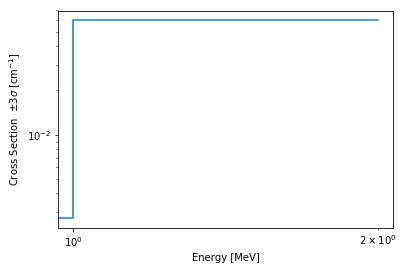
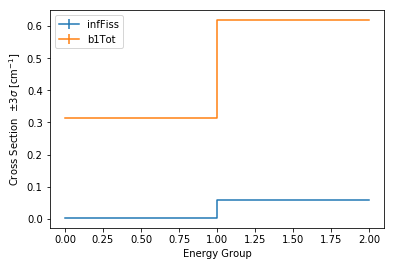

.. |BranchContainer| replace:: :class:`~serpentTools.objects.BranchContainer`
.. |HomogUnivPlot| replace:: :meth:`~serpentTools.objects.HomogUniv.plot`

.. _branching-ex:

.. note::

    Data files, like the one used in this example, are not included with the
    python distribution. They can be downloaded from the GitHub repository,
    and accessed after setting the ``SERPENT_TOOLS_DATA`` environment
    variable

.. code::

    >>> import os
    >>> branchFile = os.path.join(
    ...     os.environ["SERPENT_TOOLS_DATA"],
    ...     "demo.coe")

Branching Reader
================

This notebook demonstrates the capability of the
`serpentTools <https://github.com/CORE-GATECH-GROUP/serpent-tools>`_
package to read branching coefficient files. The format of these files
is structured to iterate over:

1. Branch states, e.g. burnup, material properties
2. Homogenized universes
3. Group constant data

The output files are described in more detail on the 
`SERPENT Wiki <http://serpent.vtt.fi/mediawiki/index.php/Automated_burnup_sequence#Output_format>`_

Basic Operation
---------------

.. note::

    Without modifying the settings, the
    |BranchingReader| assumes that all
    group constant data is presented without the associated uncertainties.
    See :ref:`branching-settings` for examples on the various ways to
    control operation

The branches are stored in custom dictionary-like |BranchContainer|
objects in the :attr:`~serpentTools.BranchingReader.branches` dictionary

.. code:: 
    
    >>> import serpentTools
    >>> r0 = serpentTools.read(branchFile)
    >>> r0.branches.keys()
    dict_keys([
        ('nom', 'nom'),
        ('B750', 'nom'),
        ('B1000', 'nom'),
        ('nom', 'FT1200'),
        ('B750', 'FT1200'),
        ('B1000', 'FT1200'),
        ('nom', 'FT600'),
        ('B750', 'FT600'),
        ('B1000', 'FT600')
    ])

Here, the keys are tuples of strings indicating what
perturbations/branch states were applied for each ``SERPENT`` solution.
Examining a particular case

.. code:: 
    
    >>> b0 = r0.branches['B1000', 'FT600']
    >>> print(b0)
    <BranchContainer for B1000, FT600 from demo.coe>

``SERPENT`` allows the user to define variables for each branch through 
``var V1_name V1_value`` cards. These are stored in the 
:attr:`~serpentTools.objects.BranchContainer.stateData` attribute

.. code:: 
    
    >>> b0.stateData
    {'BOR': '1000',
     'DATE': '17/12/19',
     'TFU': '600',
     'TIME': '09:48:54',
     'VERSION': '2.1.29'}

The keys ``'DATE'``, ``'TIME'``, and ``'VERSION'`` are included by
default in the output, while the ``'BOR'`` and ``'TFU'`` have been
defined for this branch.

Group Constant Data
~~~~~~~~~~~~~~~~~~~

.. note::

    Group constants are converted from ``SERPENT_STYLE`` to
    ``mixedCase`` to fit the overall style of the project.

The |BranchContainer| stores group constant data in |HomogUniv| objects as a dictionary.

.. code:: 
    
    >>> for key in b0:
    ...     print(key)
    UnivTuple(universe='0', burnup=0.0, step=0, days=None)
    UnivTuple(universe='10', burnup=0.0, step=0, days=None)
    UnivTuple(universe='20', burnup=0.0, step=0, days=None)
    UnivTuple(universe='30', burnup=0.0, step=0, days=None)
    UnivTuple(universe='40', burnup=0.0, step=0, days=None)
    UnivTuple(universe='0', burnup=1.0, step=1, days=None)
    UnivTuple(universe='10', burnup=1.0, step=1, days=None)
    UnivTuple(universe='20', burnup=1.0, step=1, days=None)
    UnivTuple(universe='30', burnup=1.0, step=1, days=None)
    UnivTuple(universe='40', burnup=1.0, step=1, days=None)
    UnivTuple(universe='0', burnup=10.0, step=2, days=None)
    UnivTuple(universe='10', burnup=10.0, step=2, days=None)
    UnivTuple(universe='20', burnup=10.0, step=2, days=None)
    UnivTuple(universe='30', burnup=10.0, step=2, days=None)
    UnivTuple(universe='40', burnup=10.0, step=2, days=None)

The keys here are :class:`~serpentTools.objects.UnivTuple` instances
indicating the universe ID, and point in the burnup schedule.
These universes can be obtained by indexing this dictionary, or by using
the :meth:`~serpentTools.objects.BranchContainer.getUniv` method

.. code:: 
    
    >>> univ0 = b0["0", 1, 1, None]
    >>> print(univ0)
    <HomogUniv 0: burnup: 1.000 MWd/kgu, step: 1>
    >>> univ0.name, univ0.bu, univ0.step, univ0.day
    ('0', 1.0, 1, None)
    >>> univ1 = b0.getUniv('0', burnup=1)
    >>> univ2 = b0.getUniv('0', index=1)
    >>> univ0 is univ1 is univ2
    True

Group constant data is spread out across the following sub-dictionaries:

1. |HomogUniv-infExp|: Expected values for infinite medium group constants
2. |HomogUniv-infUnc|: Relative uncertainties for infinite medium group constants
3. |HomogUniv-b1Exp|: Expected values for leakage-corrected group constants
4. |HomogUniv-b1Unc|: Relative uncertainties for leakage-corrected group constants
5. |HomogUniv-gc|: Group constant data that does not match the ``INF`` nor ``B1`` scheme
6. |HomogUniv-gcUnc|: Relative uncertainties for data in |HomogUniv-gc|

For this problem, only expected values for infinite and critical
spectrum (b1) group constants are returned, so only the ``infExp`` and
``b1Exp`` dictionaries contain data

.. code:: 
    
    >>> univ0.infExp
    {'infDiffcoef': array([ 1.83961 ,  0.682022]),
     'infFiss': array([ 0.00271604,  0.059773  ]),
     'infS0': array([ 0.298689  ,  0.00197521,  0.00284247,  0.470054  ]),
     'infS1': array([ 0.0847372 ,  0.00047366,  0.00062865,  0.106232  ]),
     'infTot': array([ 0.310842,  0.618286])}
    >>> univ0.infUnc
    {}
    >>> univ0.b1Exp
    {'b1Diffcoef': array([ 1.79892 ,  0.765665]),
     'b1Fiss': array([ 0.00278366,  0.0597712 ]),
     'b1S0': array([ 0.301766  ,  0.0021261 ,  0.00283866,  0.470114  ]),
     'b1S1': array([ 0.0856397 ,  0.00051071,  0.00062781,  0.106232  ]),
     'b1Tot': array([ 0.314521,  0.618361])}
    >>> univ0.gc
    {}
    >>> univ0.gcUnc
    {}

Group constants and their associated uncertainties can be obtained using
the :meth:`~serpentTools.objects.HomogUniv.get` method.

.. code:: 
    
    >>> univ0.get('infFiss')
    array([ 0.00271604,  0.059773  ])
    
    >>> try:
    ...     univ0.get('infS0', uncertainty=True)
    >>> except KeyError as ke:  # no uncertainties here
    ...     print(str(ke))
    'Variable infS0 absent from uncertainty dictionary'

Plotting Universe Data
----------------------

|HomogUniv| objects are capable of plotting homogenized data using the
|HomogUnivPlot| method. This method is tuned to plot group constants, such as
cross sections, for a known group structure. This is reflected in the
default axis scaling, but can be adjusted on a per case basis. If the
group structure is not known, then the data is plotted simply against
bin-index.

.. code:: 
    
    >>> univ0.plot('infFiss');

.. code:: 
    
    >>> univ0.plot(['infFiss', 'b1Tot'], loglog=False);

The |ResultsReader| example has a more thorough example of this |HomogUnivPlot|
method, including formatting the line labels - :ref:`ex-res-plotUniv`.

Iteration
---------

The branching reader has a
:meth:`~serpentTools.BranchingReader.iterBranches`
method that works to yield branch names and their associated
|BranchContainer| objects. This can
be used to efficiently iterate over all the branches presented in the file.

.. code:: 
    
    >>> for names, branch in r0.iterBranches():
    ...     print(names, branch)
    ('nom', 'FT1200') <BranchContainer for nom, FT1200 from demo.coe>
    ('B1000', 'FT1200') <BranchContainer for B1000, FT1200 from demo.coe>
    ('B750', 'FT600') <BranchContainer for B750, FT600 from demo.coe>
    ('nom', 'nom') <BranchContainer for nom, nom from demo.coe>
    ('B750', 'FT1200') <BranchContainer for B750, FT1200 from demo.coe>
    ('B1000', 'FT600') <BranchContainer for B1000, FT600 from demo.coe>
    ('nom', 'FT600') <BranchContainer for nom, FT600 from demo.coe>
    ('B1000', 'nom') <BranchContainer for B1000, nom from demo.coe>
    ('B750', 'nom') <BranchContainer for B750, nom from demo.coe>

.. _branching-settings:

User Control
------------

The ``SERPENT``
`set coefpara <http://serpent.vtt.fi/mediawiki/index.php/Input_syntax_manual#set_coefpara>`_
card already restricts the data present in the coefficient file to user
control, and the |BranchingReader|  includes similar control. 

  * :ref:`branching-floatvariables`
  * :ref:`branching-intVariables`
  * :ref:`xs-getB1XS`
  * :ref:`xs-getInfXS`
  * :ref:`xs-reshapeScatter`
  * :ref:`xs-variableExtras`
  * :ref:`xs-variableGroups`

In our example above, the ``BOR`` and ``TFU`` variables represented
boron concentration and fuel temperature, and can easily be cast into
numeric values using the :ref:`branching-intVariables` and
:ref:`branching-floatVariables` settings. From the previous example, we see
that the default action is to store all state data variables as strings.

.. code:: 

    >>> assert isinstance(b0.stateData['BOR'], str)

As demonstrated in the :ref:`group-const-variables` example, use of
:ref:`xs-variableExtras` and :ref:`xs-variableGroups` controls what data is
stored on the |HomogUniv| 
objects. By default, all variables present in the coefficient file are stored.

.. code:: 
    
    >>> from serpentTools.settings import rc
    >>> rc['branching.floatVariables'] = ['BOR']
    >>> rc['branching.intVariables'] = ['TFU']
    >>> rc['xs.getB1XS'] = False
    >>> rc['xs.variableExtras'] = ['INF_TOT', 'INF_SCATT0']
    >>> r1 = serpentTools.readDataFile(branchFile)
    >>> b1 = r1.branches['B1000', 'FT600']
    >>> b1.stateData
    {'BOR': 1000.0,
     'DATE': '17/12/19',
     'TFU': 600,
     'TIME': '09:48:54',
     'VERSION': '2.1.29'}
    >>> assert isinstance(b1.stateData['BOR'], float)
    >>> assert isinstance(b1.stateData['TFU'], int)

Inspecting the data stored on the homogenized universes reveals only the
variables explicitly requested are present

.. code:: 
    
    >>> univ4 = b1.getUniv("0", 0)
    >>> univ4.infExp
    {'infTot': array([ 0.313338,  0.54515 ])}
    >>> univ4.b1Exp
    {}

Conclusion
----------

The |BranchingReader| is capable of reading coefficient files created
by the ``SERPENT`` automated branching process. The data is stored
according to the branch parameters, universe information, and burnup.
This reader also supports user control of the processing by selecting
what state parameters should be converted from strings to numeric types,
and further down-selection of data.
