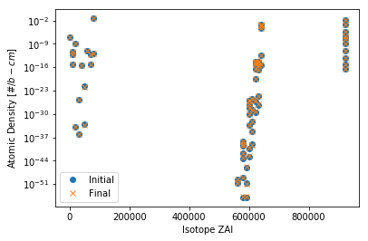
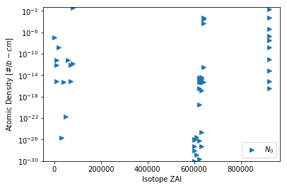
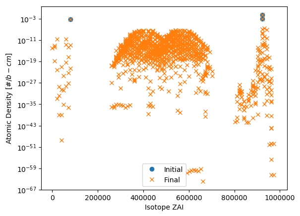

.. _depmtx-reader-ex:

.. note::

    Data files, like the one used in this example, are not included with the
    python distribution. They can be downloaded from the GitHub repository,
    and accessed after setting the ``SERPENT_TOOLS_DATA`` environment
    variable

.. code::

    >>> import os
    >>> mtxFile = os.path.join(
    ...     os.environ["SERPENT_TOOLS_DATA"],
    ...     "depmtx_ref.m")

=======================
Depletion Matrix Reader
=======================

The ``serpentTools`` package supports reading depletion matrix files, generated when
``set depmtx 1`` is added to the input file. As of ``SERPENT`` 2.1.30, these files contain

   1. The length of time for a depletion interval
   2. Vector of initial concentrations for all isotopes present in the
      depletion problem
   3. ZAI vector
   4. Depletion matrix governing destruction and transmutation of isotopes
   5. Vector of final concentrations following one depletion event

Files such as this are present for each burnable material tracked by ``SERPENT`` and
at each time step in the problem.

This document will demonstrate the |DepmtxReader|, designed to store such data.

.. note::

   The depletion matrices can be very large for most problems, ~1000 x 1000 elements.
   For this reason, the |DepmtxReader| can store matrices in
   `Compressed Sparse Column <https://docs.scipy.org/doc/scipy/reference/generated/scipy.sparse.csc_matrix.html>`_
   or full :term:`numpy` arrays. The reader will use the sparse format
   if :term:`scipy` is installed unless explicitely told to use dense arrays.

Basic Operation
===============

.. code::

   >>> import serpentTools
   >>> reader = serpentTools.read(mtxFile)
   >>> reader
   <serpentTools.parsers.depmatrix.DepmtxReader at 0x7f0b1a9702b0>

We now have access to all the data present in the file directly on the reader.

.. code::

   >>> reader.n0
   array([1.17344222e-07, 6.10756908e-12, 7.48053806e-13, 7.52406757e-16,
          1.66113020e-34, 1.67580185e-09, 1.19223790e-36, 1.89040622e-26,
          5.09195054e-16, 7.91142112e-34, 1.68989876e-22, 6.92676695e-12,
          7.52406345e-16, 8.52076751e-13, 4.52429540e-02, 1.71307881e-12,
          1.86228871e-51, 2.32287315e-50, 1.15352152e-55, 7.72524686e-50,
          5.74084741e-44, 1.55414063e-42, 3.10757266e-40, 9.12566461e-40,
          6.82216144e-39, 9.71825616e-56, 1.59237444e-51, 1.14764875e-46,
          1.15203415e-43, 5.66072799e-41, 4.49411601e-34, 8.99210202e-31,
          8.65694179e-29, 5.96910982e-28, 1.06642058e-26, 9.10883647e-27,
          7.56006632e-36, 6.08157358e-33, 7.93562601e-40, 1.67857401e-29,
          2.76995718e-26, 2.42939173e-30, 6.93658246e-27, 3.21960435e-20,
          4.14863808e-17, 6.02145579e-16, 3.68254657e-15, 2.25927183e-15,
          2.85992932e-15, 5.34540710e-28, 2.34532631e-25, 1.36140065e-17,
          4.17935379e-16, 4.61527247e-15, 2.15346589e-15, 2.90307762e-15,
          4.90358169e-16, 3.62499544e-13, 4.61691784e-05, 2.96919439e-04,
          4.13730091e-04, 3.14746134e-04, 4.98296713e-04, 4.37637914e-04,
          3.84679634e-17, 6.87038906e-14, 4.29307714e-06, 5.62156587e-04,
          2.98288610e-08, 1.45634092e-09, 2.05487374e-02, 2.10836706e-07,
          9.84180195e-12, 8.05226656e-16], dtype=float128)

This specific input file did not include
`fission yield libraries <http://serpent.vtt.fi/mediawiki/index.php/Input_syntax_manual#set_nfylib>`_
and thus only tracks 74 isotopes, rather than 1000+, through depletion.
This was intentionally done to reduce the size of files tracked in this project.

Number densities and entries in the depletion matrix are stored using the
:class:`numpy.longfloat` data type to preserve the precision present in the output files.

.. code::

   >>> reader.zai
   array([    -1,  10010,  10020,  10030,  20030,  20040,  30060,  30070,
           40090,  50100,  50110,  60120,  70140,  70150,  80160,  80170,
           561380, 561400, 581380, 581390, 581400, 581410, 581420, 581430,
           581440, 591410, 591420, 591430, 601420, 601430, 601440, 601450,
           601460, 601470, 601480, 601500, 611470, 611480, 611481, 611490,
           611510, 621470, 621480, 621490, 621500, 621510, 621520, 621530,
           621540, 631510, 631520, 631530, 631540, 631550, 631560, 631570,
           641520, 641530, 641540, 641550, 641560, 641570, 641580, 641600,
           922320, 922330, 922340, 922350, 922360, 922370, 922380, 922390,
           922400, 922410])

One can easily check if the depletion matrix is stored in a sparse or dense structure using the 
:attr:`~serpentTools.DepmtxReader.sparse` attribute::

   >>> reader.sparse
   True
   >>> reader.depmtx
   <74x74 sparse matrix of type ',class 'numpy.float128'>'
      with 633 stored elements in Compressed Sparse Column format>

A simple plot method can be used to plot initial concentrations, final concentrations,
or both::

  >>> reader.plotDensity()

Some options can be passed to alter the formatting of the plot::

   >>> reader.plotDensity(
         what='n0',  # plot only initial concentration
         markers='>',  # marker for scatter plot
         labels='$N_0$'  # label for each plotted entry
         ylim=1E-30,  # set the lower y-axis limit
      )

We can see that there is not a lot of change in the isotopic concentration
in this depletion step.
Furthermore, the classical fission yield distributions are not present
due to the lack of fission yield data.
Using a more complete, and typical data set, one can view the distribution
of fission products more clearly, demonstrated in the below plot.

