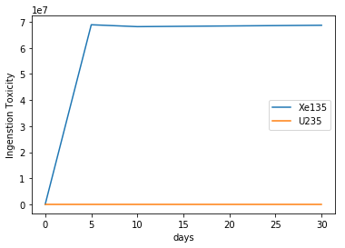

.. _depletion-reader-ex:

===============
DepletionReader
===============

Basic Operation
---------------
SERPENT produces a
`burned material file <http://serpent.vtt.fi/mediawiki/index.php/Description_of_output_files#Burnup_calculation_output>`_,
containing the evolution of material properties through burnup for all
burned materials present in the problem. The
:py:class:`~serpentTools.parsers.depletion.DepletionReader` is capable of reading
this file, and storing the data inside
:py:class:`~serpentTools.objects.materials.DepletedMaterial` objects.
Each such object has methods and attributes that should ease analysis.

.. code:: 

    >>> import six
    >>> import serpentTools
    >>> from serpentTools.settings import rc
    INFO    : serpentTools: Using version 0.2.1
    >>> depFile = 'demo_dep.m'
    >>> dep = serpentTools.read(depFile)
    INFO    : serpentTools: Inferred reader for demo_dep.m: DepletionReader
    INFO    : serpentTools: Preparing to read demo_dep.m
    INFO    : serpentTools: Done reading depletion file

The materials read in from the file are stored in the ``materials``
dictionary, where the keys represent the name of specific materials, and
the corresponding values are the depleted material.

.. code:: 

    >>> dep.materials
    {'bglass0': <serpentTools.objects.materials.DepletedMaterial at 0x23905154668>,
     'fuel0': <serpentTools.objects.materials.DepletedMaterial at 0x2390578eeb8>,
     'total': <serpentTools.objects.materials.DepletedMaterial at 0x2390579e978>}

Metadata, such as the isotopic vector and depletion schedule are also
present inside the reader

.. code:: 

    >>> dep.metadata.keys()
    dict_keys(['zai', 'burnup', 'names', 'days'])
    >>> dep.metadata['burnup']
    array([ 0.  ,  0.02,  0.04,  ...,  1.36,  1.38,  1.4 ,  1.42])
    >>> dep.metadata['names']
    ['Xe135', 'I135', 'U234', 'U235', 'U236', 'U238', 'Pu238',
     'Pu239',..., 'lost', 'total']

DepletedMaterial
----------------

As mentioned before, all the material data is stored inside these
:py:class:`~serpentTools.objects.materials.DepletedMaterial` objects.
These objects share access to the metadata of the reader as well.

.. code:: 

    >>> fuel = dep.materials['fuel0']
    >>> fuel.burnup
    array([ 0.  ,  0.02,  0.04,  ...,  1.36,  1.38,  1.4 ,  1.42])
    >>> fuel.days is dep.metadata['days']
    True

All of the variables present in the depletion file for this material are
present, stored in the ``data`` dictionary. A few properties commonly
used are accessible as attributes as well.

.. code:: 

    >>> fuel.data.keys()
    dict_keys(['a', 'adens', 'burnup', 'gsrc', ..., 'volume'])
    >>> fuel.adens
    array([[  0.00000000e+00,   2.43591000e-09,   4.03796000e-09, ...,
              4.70133000e-09,   4.70023000e-09,   4.88855000e-09],
           [  0.00000000e+00,   6.06880000e-09,   8.11783000e-09, ...,
              8.05991000e-09,   8.96359000e-09,   9.28554000e-09],
           [  4.48538000e-06,   4.48486000e-06,   4.48432000e-06, ...,
              4.44726000e-06,   4.44668000e-06,   4.44611000e-06],
           ..., 
           [  0.00000000e+00,   3.03589000e-11,   7.38022000e-11, ...,
              1.62829000e-09,   1.63566000e-09,   1.64477000e-09],
           [  0.00000000e+00,   1.15541000e-14,   2.38378000e-14, ...,
              8.60736000e-13,   8.73669000e-13,   8.86782000e-13],
           [  6.88332000e-02,   6.88334000e-02,   6.88336000e-02, ...,
              6.88455000e-02,   6.88457000e-02,   6.88459000e-02]])

Similar to the original file, the rows of the matrix correspond to
positions in the isotopic vector, and the columns correspond to
positions in burnup/day vectors.

.. code:: 

    >>> fuel.mdens.shape  # rows, columns
    (34, 72)
    >>> fuel.burnup.shape
    (72,)
    >>> len(fuel.names)
    34

Data Retrieval
--------------

At the heart of the :py:class:`~serpentTools.objects.materials.DepletedMaterial`
is the
:py:meth:`~serpentTools.objects.materials.DepletedMaterial.getValues` method.
This method acts as an slicing mechanism that returns data for a select
number of isotopes at select points in time.

.. code:: 

    >>> dayPoints = [0, 5, 10, 30]
    >>> iso = ['Xe135', 'U235']
    >>> vals = fuel.getValues('days', 'a', dayPoints, iso)
    >>> print(vals.shape)
    (2, 4)
    >>> print(vals)
    [[  0.00000000e+00   3.28067000e+14   3.24606000e+14   3.27144000e+14]
     [  5.36447000e+07   5.34519000e+07   5.32499000e+07   5.24766000e+07]]
    

The :py:class:`~serpentTools.objects.materials.DepletedMaterial` uses
this slicing for the built-in
:py:meth:`~serpentTools.objects.materials.DepletedMaterial.plot` method

.. code:: 

    >>> fuel.plot('days', 'ingTox', dayPoints, iso,
                  ylabel='Ingenstion Toxicity');

Limitations
-----------

Currently, the :py:class:`~serpentTools.parsers.DepletionReader`
cannot catch materials with underscore in the name, due to variables
like ``ING_TOX`` also containing an underscore.
Issue `#58 <https://github.com/CORE-GATECH-GROUP/serpent-tools/issues/58>`_

Settings
--------

The :py:class:`~serpentTools.parsers.DepletionReader`
also has a collection of settings to control
what data is stored. If none of these settings are modified, the default
is to store all the data from the output file.

.. code:: 

    >>> from serpentTools.settings import rc, defaultSettings
    >>> for setting in defaultSettings:
    >>>     if 'depletion' in setting:
    >>>         print(setting)
    >>>         for k, v in six.iteritems(defaultSettings[setting]):
    >>>             print('\t', k, v)
    depletion.materials
         type <class 'list'>
         description Names of materials to store. Empty list -> all materials.
         default []
    depletion.processTotal
        type <class 'bool'>
        description Option to store the depletion data from the TOT block
        default True
    depletion.materialVariables
        type <class 'list'>
        description Names of variables to store. Empty list -> all variables.
        default []
    depletion.metadataKeys
        type <class 'list'>
        description Non-material data to store, i.e. zai, isotope names, burnup schedule, etc.
        options default
        default ['ZAI', 'NAMES', 'DAYS', 'BU']

Below is an example of configuring a ``DepletionReader`` that only
stores the burnup days, and atomic density for all materials that begin
with ``bglass`` followed by at least one integer.

.. note::

    Creating the ``DepletionReader`` in this manner is functionally
    equivalent to ``serpentTools.read(depFile)``

.. code:: 

    >>> rc['depletion.processTotal'] = False
    >>> rc['depletion.metadataKeys'] = ['BU']
    >>> rc['depletion.materialVariables'] = ['ADENS']
    >>> rc['depletion.materials'] = [r'bglass\d+']
    >>>
    >>> bgReader = serpentTools.parsers.DepletionReader(depFile)
    >>> bgReader.read()
    INFO    : serpentTools: Preparing to read demo_dep.m
    INFO    : serpentTools: Done reading depletion file
    >>> bgReader.materials
    {'bglass0': <serpentTools.objects.materials.DepletedMaterial at 0x239057dcb00>}
    >>> bglass = bgReader.materials['bglass0']
    >>> bglass.data
    {'adens': array([[ 0.       ,  0.       ,  0.       , ...,  0.       ,  0.       ,
              0.       ],
            [ 0.       ,  0.       ,  0.       , ...,  0.       ,  0.       ,
              0.       ],
            [ 0.       ,  0.       ,  0.       , ...,  0.       ,  0.       ,
              0.       ],
            ..., 
            [ 0.       ,  0.       ,  0.       , ...,  0.       ,  0.       ,
              0.       ],
            [ 0.       ,  0.       ,  0.       , ...,  0.       ,  0.       ,
              0.       ],
            [ 0.0715841,  0.0715843,  0.0715845, ...,  0.0715968,  0.0715969,
              0.0715971]])}
    >>> bglass.data.keys()
    dict_keys(['adens'])

Conclusion
----------

The ``DepletionReader`` is capable of reading and storing all the data
from the SERPENT burned materials file. Upon reading, the reader creates
custom ``DepletedMaterial`` objects that are responsible for storing and
retrieving the data. These objects also have a handy ``plot`` method for
quick analysis. Use of the ``rc`` settings control object allows
increased control over the data selected from the output file.

References
----------

1. J. Leppänen, M. Pusa, T. Viitanen, V. Valtavirta, and T.
   Kaltiaisenaho. "The Serpent Monte Carlo code: Status, development and
   applications in 2013." Ann. Nucl. Energy, `82 (2015)
   142-150 <https://www.sciencedirect.com/science/article/pii/S0306454914004095>`_
