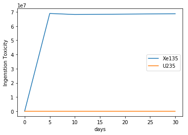

Copyright (c) 2017 Andrew Johnson, Dan Kotlyar, GTRC

THE SOFTWARE IS PROVIDED "AS IS", WITHOUT WARRANTY OF ANY KIND, EXPRESS
OR IMPLIED, INCLUDING BUT NOT LIMITED TO THE WARRANTIES OF
MERCHANTABILITY, FITNESS FOR A PARTICULAR PURPOSE AND NONINFRINGEMENT.
IN NO EVENT SHALL THE AUTHORS OR COPYRIGHT HOLDERS BE LIABLE FOR ANY
CLAIM, DAMAGES OR OTHER LIABILITY, WHETHER IN AN ACTION OF CONTRACT,
TORT OR OTHERWISE, ARISING FROM, OUT OF OR IN CONNECTION WITH THE
SOFTWARE OR THE USE OR OTHER DEALINGS IN THE SOFTWARE.

``DepletionReader``
===================

Basic Operation
---------------

This notebook demonstrates the capabilities of the
```serpentTools`` <https://github.com/CORE-GATECH-GROUP/serpent-tools>`__
in regards to reading depleted material files. SERPENT [1] produces a
`burned material
file <http://serpent.vtt.fi/mediawiki/index.php/Description_of_output_files#Burnup_calculation_output>`__,
containing the evolution of material properties through burnup for all
burned materials present in the problem. The ``DepletionReader`` is
capable of reading this file, and storing the data inside
``DepletedMaterial`` objects. Each such object has methods and
attributes that should ease analysis.

.. code:: ipython3

    %matplotlib inline
    import six
    
    import serpentTools
    from serpentTools.settings import rc


.. parsed-literal::

    INFO    : serpentTools: Using version 1.0b0+24.g23e6eac.dirty
    

.. code:: ipython3

    depFile = 'demo_dep.m'
    dep = serpentTools.read(depFile)


.. parsed-literal::

    INFO    : serpentTools: Inferred reader for demo_dep.m: DepletionReader
    INFO    : serpentTools: Preparing to read demo_dep.m
    INFO    : serpentTools: Done reading depletion file
    

The materials read in from the file are stored in the ``materials``
dictionary, where the keys represent the name of specific materials, and
the corresponding values are the depleted material.

.. code:: ipython3

    dep.materials


.. parsed-literal::

    {'bglass0': <serpentTools.objects.materials.DepletedMaterial at 0x23905154668>,
     'fuel0': <serpentTools.objects.materials.DepletedMaterial at 0x2390578eeb8>,
     'total': <serpentTools.objects.materials.DepletedMaterial at 0x2390579e978>}


Metadata, such as the isotopic vector and depletion schedule are also
present inside the reader

.. code:: ipython3

    dep.metadata.keys()


.. parsed-literal::

    dict_keys(['zai', 'burnup', 'names', 'days'])


.. code:: ipython3

    dep.metadata['burnup']


.. parsed-literal::

    array([ 0.  ,  0.02,  0.04,  0.06,  0.08,  0.1 ,  0.12,  0.14,  0.16,
            0.18,  0.2 ,  0.22,  0.24,  0.26,  0.28,  0.3 ,  0.32,  0.34,
            0.36,  0.38,  0.4 ,  0.42,  0.44,  0.46,  0.48,  0.5 ,  0.52,
            0.54,  0.56,  0.58,  0.6 ,  0.62,  0.64,  0.66,  0.68,  0.7 ,
            0.72,  0.74,  0.76,  0.78,  0.8 ,  0.82,  0.84,  0.86,  0.88,
            0.9 ,  0.92,  0.94,  0.96,  0.98,  1.  ,  1.02,  1.04,  1.06,
            1.08,  1.1 ,  1.12,  1.14,  1.16,  1.18,  1.2 ,  1.22,  1.24,
            1.26,  1.28,  1.3 ,  1.32,  1.34,  1.36,  1.38,  1.4 ,  1.42])


.. code:: ipython3

    dep.metadata['names']


.. parsed-literal::

    ['Xe135',
     'I135',
     'U234',
     'U235',
     'U236',
     'U238',
     'Pu238',
     'Pu239',
     'Pu240',
     'Pu241',
     'Pu242',
     'Np237',
     'Am241',
     'Am243',
     'Cm243',
     'Cm244',
     'Cm245',
     'Cs133',
     'Nd143',
     'Sm147',
     'Sm149',
     'Sm150',
     'Sm151',
     'Sm152',
     'Eu153',
     'Gd155',
     'Mo95',
     'Tc99',
     'Ru101',
     'Rh103',
     'Ag109',
     'Cd113',
     'lost',
     'total']


DepletedMaterial
----------------

As mentioned before, all the material data is stored inside these
``DepletedMaterial`` objects. These objects share access to the metadata
as well.

.. code:: ipython3

    fuel = dep.materials['fuel0']

.. code:: ipython3

    fuel.burnup


.. parsed-literal::

    array([ 0.        ,  0.00702676,  0.0144405 ,  0.0218803 ,  0.0297245 ,
            0.0370823 ,  0.0447201 ,  0.0513465 ,  0.0590267 ,  0.0671439 ,
            0.073392  ,  0.0802637 ,  0.0887954 ,  0.0974604 ,  0.104807  ,
            0.111528  ,  0.119688  ,  0.128006  ,  0.135704  ,  0.143491  ,
            0.150545  ,  0.157608  ,  0.165391  ,  0.172872  ,  0.180039  ,
            0.188011  ,  0.195215  ,  0.202291  ,  0.20963   ,  0.216895  ,
            0.224651  ,  0.232139  ,  0.23904   ,  0.246076  ,  0.25422   ,
            0.262011  ,  0.269681  ,  0.276981  ,  0.284588  ,  0.291835  ,
            0.299661  ,  0.30727   ,  0.314781  ,  0.322364  ,  0.329404  ,
            0.336926  ,  0.34438   ,  0.352246  ,  0.360913  ,  0.367336  ,
            0.37415   ,  0.381556  ,  0.388951  ,  0.396286  ,  0.404159  ,
            0.412113  ,  0.419194  ,  0.426587  ,  0.43425   ,  0.442316  ,
            0.449562  ,  0.456538  ,  0.465128  ,  0.472592  ,  0.479882  ,
            0.487348  ,  0.494634  ,  0.502167  ,  0.508326  ,  0.515086  ,
            0.522826  ,  0.530643  ])


.. code:: ipython3

    fuel.days is dep.metadata['days']


.. parsed-literal::

    True


All of the variables present in the depletion file for this material are
present, stored in the ``data`` dictionary. A few properties commonly
used are accessible as attributes as well.

.. code:: ipython3

    fuel.data


.. parsed-literal::

    {'a': array([[  0.00000000e+00,   1.58037000e+14,   2.61974000e+14, ...,
               3.05012000e+14,   3.04941000e+14,   3.17159000e+14],
            [  0.00000000e+00,   5.47747000e+14,   7.32685000e+14, ...,
               7.27457000e+14,   8.09020000e+14,   8.38078000e+14],
            [  1.23592000e+09,   1.23577000e+09,   1.23563000e+09, ...,
               1.22541000e+09,   1.22525000e+09,   1.22510000e+09],
            ..., 
            [  0.00000000e+00,   2.66709000e-07,   6.48366000e-07, ...,
               1.43048000e-05,   1.43696000e-05,   1.44496000e-05],
            [  0.00000000e+00,   0.00000000e+00,   0.00000000e+00, ...,
               0.00000000e+00,   0.00000000e+00,   0.00000000e+00],
            [  1.62890000e+09,   6.19886000e+16,   6.85829000e+16, ...,
               7.74227000e+16,   8.60413000e+16,   8.70468000e+16]]),
     'adens': array([[  0.00000000e+00,   2.43591000e-09,   4.03796000e-09, ...,
               4.70133000e-09,   4.70023000e-09,   4.88855000e-09],
            [  0.00000000e+00,   6.06880000e-09,   8.11783000e-09, ...,
               8.05991000e-09,   8.96359000e-09,   9.28554000e-09],
            [  4.48538000e-06,   4.48486000e-06,   4.48432000e-06, ...,
               4.44726000e-06,   4.44668000e-06,   4.44611000e-06],
            ..., 
            [  0.00000000e+00,   3.03589000e-11,   7.38022000e-11, ...,
               1.62829000e-09,   1.63566000e-09,   1.64477000e-09],
            [  0.00000000e+00,   1.15541000e-14,   2.38378000e-14, ...,
               8.60736000e-13,   8.73669000e-13,   8.86782000e-13],
            [  6.88332000e-02,   6.88334000e-02,   6.88336000e-02, ...,
               6.88455000e-02,   6.88457000e-02,   6.88459000e-02]]),
     'burnup': array([ 0.        ,  0.00702676,  0.0144405 ,  0.0218803 ,  0.0297245 ,
             0.0370823 ,  0.0447201 ,  0.0513465 ,  0.0590267 ,  0.0671439 ,
             0.073392  ,  0.0802637 ,  0.0887954 ,  0.0974604 ,  0.104807  ,
             0.111528  ,  0.119688  ,  0.128006  ,  0.135704  ,  0.143491  ,
             0.150545  ,  0.157608  ,  0.165391  ,  0.172872  ,  0.180039  ,
             0.188011  ,  0.195215  ,  0.202291  ,  0.20963   ,  0.216895  ,
             0.224651  ,  0.232139  ,  0.23904   ,  0.246076  ,  0.25422   ,
             0.262011  ,  0.269681  ,  0.276981  ,  0.284588  ,  0.291835  ,
             0.299661  ,  0.30727   ,  0.314781  ,  0.322364  ,  0.329404  ,
             0.336926  ,  0.34438   ,  0.352246  ,  0.360913  ,  0.367336  ,
             0.37415   ,  0.381556  ,  0.388951  ,  0.396286  ,  0.404159  ,
             0.412113  ,  0.419194  ,  0.426587  ,  0.43425   ,  0.442316  ,
             0.449562  ,  0.456538  ,  0.465128  ,  0.472592  ,  0.479882  ,
             0.487348  ,  0.494634  ,  0.502167  ,  0.508326  ,  0.515086  ,
             0.522826  ,  0.530643  ]),
     'gsrc': array([[  0.00000000e+00,   1.57292000e+14,   2.60740000e+14, ...,
               3.03575000e+14,   3.03504000e+14,   3.15664000e+14],
            [  0.00000000e+00,   7.29969000e+14,   9.76431000e+14, ...,
               9.69465000e+14,   1.07816000e+15,   1.11689000e+15],
            [  1.23473000e+08,   1.23458000e+08,   1.23443000e+08, ...,
               1.22423000e+08,   1.22407000e+08,   1.22392000e+08],
            ..., 
            [  0.00000000e+00,   0.00000000e+00,   0.00000000e+00, ...,
               0.00000000e+00,   0.00000000e+00,   0.00000000e+00],
            [  0.00000000e+00,   0.00000000e+00,   0.00000000e+00, ...,
               0.00000000e+00,   0.00000000e+00,   0.00000000e+00],
            [  2.13331000e+08,   4.95145000e+16,   5.53885000e+16, ...,
               6.85038000e+16,   7.52979000e+16,   7.61238000e+16]]),
     'h': array([[  0.00000000e+00,   1.42473000e+01,   2.36174000e+01, ...,
               2.74974000e+01,   2.74909000e+01,   2.85924000e+01],
            [  0.00000000e+00,   1.70546000e+02,   2.28128000e+02, ...,
               2.26500000e+02,   2.51896000e+02,   2.60943000e+02],
            [  9.61122000e-04,   9.61011000e-04,   9.60896000e-04, ...,
               9.52953000e-04,   9.52828000e-04,   9.52707000e-04],
            ..., 
            [  0.00000000e+00,   3.98684000e-21,   9.69198000e-21, ...,
               2.13833000e-19,   2.14801000e-19,   2.15997000e-19],
            [  0.00000000e+00,   0.00000000e+00,   0.00000000e+00, ...,
               0.00000000e+00,   0.00000000e+00,   0.00000000e+00],
            [  1.23320000e-03,   2.31697000e+04,   2.49259000e+04, ...,
               2.42203000e+04,   2.74409000e+04,   2.77509000e+04]]),
     'ingTox': array([[  0.00000000e+00,   3.31877000e+07,   5.50146000e+07, ...,
               6.40526000e+07,   6.40376000e+07,   6.66033000e+07],
            [  0.00000000e+00,   5.09405000e+05,   6.81397000e+05, ...,
               6.76535000e+05,   7.52389000e+05,   7.79413000e+05],
            [  6.05599000e+01,   6.05529000e+01,   6.05456000e+01, ...,
               6.00452000e+01,   6.00373000e+01,   6.00297000e+01],
            ..., 
            [  0.00000000e+00,   6.66772000e-15,   1.62092000e-14, ...,
               3.57621000e-13,   3.59240000e-13,   3.61240000e-13],
            [  0.00000000e+00,   0.00000000e+00,   0.00000000e+00, ...,
               0.00000000e+00,   0.00000000e+00,   0.00000000e+00],
            [  7.83513000e+01,   6.60738000e+08,   7.43620000e+08, ...,
               1.19210000e+09,   1.27846000e+09,   1.28958000e+09]]),
     'inhTox': array([[  0.00000000e+00,   1.73840000e+07,   2.88172000e+07, ...,
               3.35514000e+07,   3.35435000e+07,   3.48874000e+07],
            [  0.00000000e+00,   1.75279000e+05,   2.34459000e+05, ...,
               2.32786000e+05,   2.58887000e+05,   2.68185000e+05],
            [  1.16176000e+04,   1.16163000e+04,   1.16149000e+04, ...,
               1.15189000e+04,   1.15174000e+04,   1.15159000e+04],
            ..., 
            [  0.00000000e+00,   3.20050000e-14,   7.78040000e-14, ...,
               1.71658000e-12,   1.72435000e-12,   1.73395000e-12],
            [  0.00000000e+00,   0.00000000e+00,   0.00000000e+00, ...,
               0.00000000e+00,   0.00000000e+00,   0.00000000e+00],
            [  1.47883000e+04,   7.06858000e+08,   7.74841000e+08, ...,
               1.15071000e+09,   1.24640000e+09,   1.25662000e+09]]),
     'mdens': array([[  0.00000000e+00,   5.45697000e-07,   9.04592000e-07, ...,
               1.05320000e-06,   1.05295000e-06,   1.09514000e-06],
            [  0.00000000e+00,   1.35956000e-06,   1.81860000e-06, ...,
               1.80562000e-06,   2.00807000e-06,   2.08020000e-06],
            [  1.74320000e-03,   1.74300000e-03,   1.74279000e-03, ...,
               1.72838000e-03,   1.72816000e-03,   1.72794000e-03],
            ..., 
            [  0.00000000e+00,   5.69161000e-09,   1.38363000e-08, ...,
               3.05268000e-07,   3.06650000e-07,   3.08357000e-07],
            [  0.00000000e+00,   0.00000000e+00,   0.00000000e+00, ...,
               0.00000000e+00,   0.00000000e+00,   0.00000000e+00],
            [  1.02975000e+01,   1.02975000e+01,   1.02975000e+01, ...,
               1.02974000e+01,   1.02974000e+01,   1.02974000e+01]]),
     'sf': array([[  0.00000000e+00,   0.00000000e+00,   0.00000000e+00, ...,
               0.00000000e+00,   0.00000000e+00,   0.00000000e+00],
            [  0.00000000e+00,   0.00000000e+00,   0.00000000e+00, ...,
               0.00000000e+00,   0.00000000e+00,   0.00000000e+00],
            [  2.10106000e-02,   2.10082000e-02,   2.10056000e-02, ...,
               2.08320000e-02,   2.08293000e-02,   2.08266000e-02],
            ..., 
            [  0.00000000e+00,   0.00000000e+00,   0.00000000e+00, ...,
               0.00000000e+00,   0.00000000e+00,   0.00000000e+00],
            [  0.00000000e+00,   0.00000000e+00,   0.00000000e+00, ...,
               0.00000000e+00,   0.00000000e+00,   0.00000000e+00],
            [  1.85277000e+04,   1.85276000e+04,   1.85275000e+04, ...,
               1.85731000e+04,   1.85747000e+04,   1.85762000e+04]]),
     'volume': array([ 3079.78,  3079.78,  3079.78,  3079.78,  3079.78,  3079.78,
             3079.78,  3079.78,  3079.78,  3079.78,  3079.78,  3079.78,
             3079.78,  3079.78,  3079.78,  3079.78,  3079.78,  3079.78,
             3079.78,  3079.78,  3079.78,  3079.78,  3079.78,  3079.78,
             3079.78,  3079.78,  3079.78,  3079.78,  3079.78,  3079.78,
             3079.78,  3079.78,  3079.78,  3079.78,  3079.78,  3079.78,
             3079.78,  3079.78,  3079.78,  3079.78,  3079.78,  3079.78,
             3079.78,  3079.78,  3079.78,  3079.78,  3079.78,  3079.78,
             3079.78,  3079.78,  3079.78,  3079.78,  3079.78,  3079.78,
             3079.78,  3079.78,  3079.78,  3079.78,  3079.78,  3079.78,
             3079.78,  3079.78,  3079.78,  3079.78,  3079.78,  3079.78,
             3079.78,  3079.78,  3079.78,  3079.78,  3079.78,  3079.78])}


.. code:: ipython3

    fuel.adens


.. parsed-literal::

    array([[  0.00000000e+00,   2.43591000e-09,   4.03796000e-09, ...,
              4.70133000e-09,   4.70023000e-09,   4.88855000e-09],
           [  0.00000000e+00,   6.06880000e-09,   8.11783000e-09, ...,
              8.05991000e-09,   8.96359000e-09,   9.28554000e-09],
           [  4.48538000e-06,   4.48486000e-06,   4.48432000e-06, ...,
              4.44726000e-06,   4.44668000e-06,   4.44611000e-06],
           ..., 
           [  0.00000000e+00,   3.03589000e-11,   7.38022000e-11, ...,
              1.62829000e-09,   1.63566000e-09,   1.64477000e-09],
           [  0.00000000e+00,   1.15541000e-14,   2.38378000e-14, ...,
              8.60736000e-13,   8.73669000e-13,   8.86782000e-13],
           [  6.88332000e-02,   6.88334000e-02,   6.88336000e-02, ...,
              6.88455000e-02,   6.88457000e-02,   6.88459000e-02]])


Similar to the original file, the rows of the matrix correspond to
positions in the isotopic vector, and the columns correspond to
positions in burnup/day vectors.

.. code:: ipython3

    fuel.mdens.shape  # rows, columns


.. parsed-literal::

    (34, 72)


.. code:: ipython3

    fuel.burnup.shape


.. parsed-literal::

    (72,)


.. code:: ipython3

    len(fuel.names)


.. parsed-literal::

    34


Data Retrieval
--------------

At the heart of the ``DepletedMaterial`` object is the ``getValues``
method. This method acts as an slicing mechanism that returns data for a
select number of isotopes at select points in time.

.. code:: ipython3

    print(fuel.getValues.__doc__)


.. parsed-literal::

    
            Return x values for given time, and corresponding isotope values.
    
            Parameters
            ----------
            xUnits: str
                name of x value to obtain, e.g. ``'days'``, ``'burnup'``
            yUnits: str
                name of y value to return, e.g. ``'adens'``, ``'burnup'``
            timePoints: list or None
                If given, select the time points according to those specified here.
                Otherwise, select all points
            names: list or None
                If given, return y values corresponding to these isotope names.
                Otherwise, return values for all isotopes.
    
            Returns
            -------
            numpy.array
                Array of values.
    
            Raises
            ------
            AttributeError
                If the names of the isotopes have not been obtained and specific
                isotopes have been requested
            KeyError
                If at least one of the days requested is not present
            
    

.. code:: ipython3

    dayPoints = [0, 5, 10, 30]
    iso = ['Xe135', 'U235']
    vals = fuel.getValues('days', 'a', dayPoints, iso)
    print(vals.shape)
    print(vals)


.. parsed-literal::

    (2, 4)
    [[  0.00000000e+00   3.28067000e+14   3.24606000e+14   3.27144000e+14]
     [  5.36447000e+07   5.34519000e+07   5.32499000e+07   5.24766000e+07]]
    

The ``DepletedMaterial`` uses this slicing for the built in ``plot``
routine

.. code:: ipython3

    print(fuel.plot.__doc__)


.. parsed-literal::

    
            Plot some data as a function of time for some or all isotopes.
    
            Parameters
            ----------
            xUnits: str
                name of x value to obtain, e.g. ``'days'``, ``'burnup'``
            yUnits: str
                name of y value to return, e.g. ``'adens'``, ``'burnup'``
            timePoints: list or None
                If given, select the time points according to those
                specified here. Otherwise, select all points
            names: list or None
                If given, return y values corresponding to these isotope
                names. Otherwise, return values for all isotopes.
            ax: None or ``matplotlib axes``
                If given, add the data to this plot.
                Otherwise, create a new plot
            legend: bool
                Automatically add the legend
            label: bool
                Automatically label the axis
            xlabel: None or str
                If given, use this as the label for the x-axis.
                Otherwise, use xUnits
            ylabel: None or str
                If given, use this as the label for the y-axis.
                Otherwise, use yUnits
    
            Returns
            -------
            ``matplotlib axes``
                Axes corresponding to the figure that was plotted
    
            See Also
            --------
            getXY
    
            
    

.. code:: ipython3

    fuel.plot('days', 'ingTox', dayPoints, iso, 
              ylabel='Ingenstion Toxicity');





Limitations
-----------

Currently, the ``DepletionReader`` cannot catch materials with
underscore in the name, due to variables like ``ING_TOX`` also
containing underscore.

Settings
--------

The ``DepletionReader`` also has a collection of settings to control
what data is stored. If none of these settings are modified, the default
is to store all the data from the output file.

.. code:: ipython3

    from serpentTools.settings import rc, defaultSettings
    for setting in defaultSettings:
        if 'depletion' in setting:
            print(setting)
            for k, v in six.iteritems(defaultSettings[setting]):
                print('\t', k, v)


.. parsed-literal::

    depletion.materials
    	 type <class 'list'>
    	 description Names of materials to store. Empty list -> all materials.
    	 default []
    depletion.processTotal
    	 type <class 'bool'>
    	 description Option to store the depletion data from the TOT block
    	 default True
    depletion.materialVariables
    	 type <class 'list'>
    	 description Names of variables to store. Empty list -> all variables.
    	 default []
    depletion.metadataKeys
    	 type <class 'list'>
    	 description Non-material data to store, i.e. zai, isotope names, burnup schedule, etc.
    	 options default
    	 default ['ZAI', 'NAMES', 'DAYS', 'BU']
    

Below is an example of configuring a ``DepletionReader`` that only
stores the burnup days, and atomic density for all materials that begin
with ``bglass`` followed by at least one integer.

.. note::

::

    Creating the ``DepletionReader`` in this manner is functionally equivalent to serpentTools.read(depFile)

.. code:: ipython3

    rc['depletion.processTotal'] = False
    rc['depletion.metadataKeys'] = ['BU']
    rc['depletion.materialVariables'] = ['ADENS']
    rc['depletion.materials'] = [r'bglass\d+']
    
    bgReader = serpentTools.parsers.DepletionReader(depFile)
    bgReader.read()


.. parsed-literal::

    INFO    : serpentTools: Preparing to read demo_dep.m
    INFO    : serpentTools: Done reading depletion file
    

.. code:: ipython3

    bgReader.materials


.. parsed-literal::

    {'bglass0': <serpentTools.objects.materials.DepletedMaterial at 0x239057dcb00>}


.. code:: ipython3

    bglass = bgReader.materials['bglass0']
    bglass.data


.. parsed-literal::

    {'adens': array([[ 0.       ,  0.       ,  0.       , ...,  0.       ,  0.       ,
              0.       ],
            [ 0.       ,  0.       ,  0.       , ...,  0.       ,  0.       ,
              0.       ],
            [ 0.       ,  0.       ,  0.       , ...,  0.       ,  0.       ,
              0.       ],
            ..., 
            [ 0.       ,  0.       ,  0.       , ...,  0.       ,  0.       ,
              0.       ],
            [ 0.       ,  0.       ,  0.       , ...,  0.       ,  0.       ,
              0.       ],
            [ 0.0715841,  0.0715843,  0.0715845, ...,  0.0715968,  0.0715969,
              0.0715971]])}


.. code:: ipython3

    bglass.data.keys()


.. parsed-literal::

    dict_keys(['adens'])


Conclusion
----------

The ``DepletionReader`` is capable of reading and storing all the data
from the SERPENT burned materials file. Upon reading, the reader creates
custom ``DepletedMaterial`` objects that are responsible for storing and
retrieving the data. These objects also have a handy ``plot`` method for
quick analysis. Use of the ``rc`` settings control object allows
increased control over the data selected from the output file.

References
----------

1. J. Leppänen, M. Pusa, T. Viitanen, V. Valtavirta, and T.
   Kaltiaisenaho. "The Serpent Monte Carlo code: Status, development and
   applications in 2013." Ann. Nucl. Energy, `82 (2015)
   142-150 <https://www.sciencedirect.com/science/article/pii/S0306454914004095>`__
