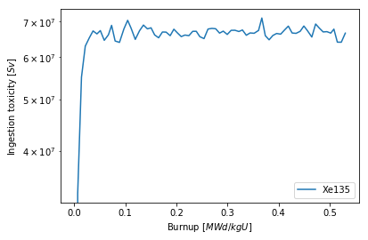
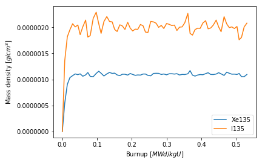
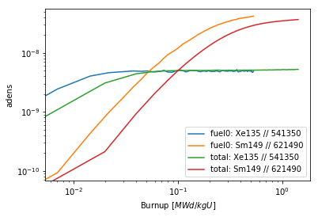

.. |DepletedMaterial| replace:: :class:`~serpentTools.objects.DepletedMaterial`
.. |materials| replace:: :attr:`~serpentTools.DepletionReader.materials`
.. |matData| replace:: :attr:`~serpentTools.objects.DepletedMaterial.data`
.. |getValues| replace:: :meth:`~serpentTools.objects.DepletedMaterial.getValues`
.. |DepletedMaterialPlot| replace:: :meth:`~serpentTools.objects.DepletedMaterial.plot` 

.. _depletion-reader-ex:

.. note::

    Data files, like the one used in this example, are not included with the
    python distribution. They can be downloaded from the GitHub repository,
    and accessed after setting the ``SERPENT_TOOLS_DATA`` environment
    variable

.. code::

    >>> import os
    >>> depFile = os.path.join(
    ...     os.environ["SERPENT_TOOLS_DATA"],
    ...     "demo_dep.m")

================
Depletion Reader
================

Basic Operation
---------------
SERPENT produces a
`burned material file <http://serpent.vtt.fi/mediawiki/index.php/Description_of_output_files#Burnup_calculation_output>`_,
containing the evolution of material properties through burnup for all
burned materials present in the problem. The |DepletionReader| is capable of reading
this file, and storing the data inside |DepletedMaterial| objects.
Each such object has methods and attributes that should ease analysis.

.. code:: 
    
    >>> import serpentTools
    >>> dep = serpentTools.read(depFile)

The materials read in from the file are stored in the |materials| 
dictionary, where the keys represent the name of specific materials, and
the corresponding values are the depleted material.

.. code:: 
    
    >>> dep.materials
    {'fuel0': <serpentTools.objects.materials.DepletedMaterial at 0x7f8f8dccde80>,
     'bglass0': <serpentTools.objects.materials.DepletedMaterial at 0x7f8f8f42f518>,
     'total': <serpentTools.objects.materials.DepletedMaterial at 0x7f8f8dce7940>}

Metadata, such as the isotopic vector and depletion schedule are also
present inside the reader

.. code:: 
    
    >>> dep.metadata.keys()
    dict_keys(['zai', 'names', 'burnup', 'days'])
    >>> dep.metadata['burnup']
    array([0.  , 0.02, 0.04, 0.06, 0.08, 0.1 , 0.12, 0.14, 0.16, 0.18, 0.2 ,
           0.22, 0.24, 0.26, 0.28, 0.3 , 0.32, 0.34, 0.36, 0.38, 0.4 , 0.42,
           0.44, 0.46, 0.48, 0.5 , 0.52, 0.54, 0.56, 0.58, 0.6 , 0.62, 0.64,
           0.66, 0.68, 0.7 , 0.72, 0.74, 0.76, 0.78, 0.8 , 0.82, 0.84, 0.86,
           0.88, 0.9 , 0.92, 0.94, 0.96, 0.98, 1.  , 1.02, 1.04, 1.06, 1.08,
           1.1 , 1.12, 1.14, 1.16, 1.18, 1.2 , 1.22, 1.24, 1.26, 1.28, 1.3 ,
           1.32, 1.34, 1.36, 1.38, 1.4 , 1.42])
    >>> dep.metadata['names']
    ['Xe135', 'I135', 'U234', 'U235', 'U236', 'U238',
     'Pu238', 'Pu239', 'Pu240', 'Pu241', 'Pu242', 'Np237',
     'Am241', 'Am243', 'Cm243', 'Cm244', 'Cm245', 'Cs133',
     'Nd143', 'Sm147', 'Sm149', 'Sm150', 'Sm151', 'Sm152',
     'Eu153', 'Gd155', 'Mo95', 'Tc99', 'Ru101', 'Rh103',
     'Ag109', 'Cd113', 'lost', 'total']

Depleted Material Objects
-------------------------

As mentioned before, all the material data is stored inside these
|DepletedMaterial| objects.
These objects share access to the metadata of the reader as well.

.. code:: 
    
    >>> fuel = dep.materials['fuel0']
    >>> print(fuel.burnup)
    [0.         0.00702676 0.0144405  0.0218803  0.0297245  0.0370823
     0.0447201  0.0513465  0.0590267  0.0671439  0.073392   0.0802637
     0.0887954  0.0974604  0.104807   0.111528   0.119688   0.128006
     0.135704   0.143491   0.150545   0.157608   0.165391   0.172872
     0.180039   0.188011   0.195215   0.202291   0.20963    0.216895
     0.224651   0.232139   0.23904    0.246076   0.25422    0.262011
     0.269681   0.276981   0.284588   0.291835   0.299661   0.30727
     0.314781   0.322364   0.329404   0.336926   0.34438    0.352246
     0.360913   0.367336   0.37415    0.381556   0.388951   0.396286
     0.404159   0.412113   0.419194   0.426587   0.43425    0.442316
     0.449562   0.456538   0.465128   0.472592   0.479882   0.487348
     0.494634   0.502167   0.508326   0.515086   0.522826   0.530643  ]
    >>> print(fuel.days is dep.metadata['days'])
    True

Materials can also be obtained by indexing directly into the reader, with

.. code::

    >>> newF = dep['fuel0']
    >>> assert newF is fuel

All of the variables present in the depletion file for this material are
present, stored in the |matData| dictionary. A few properties commonly
used are accessible as attributes as well.

.. code:: 
    
    >>> fuel.data.keys()
    dict_keys(['volume', 'burnup', 'adens', 'mdens', 'a', 'h', 'sf', 'gsrc', 'ingTox', 'inhTox'])
    >>> print(fuel.adens)
    [[0.00000e+00 2.43591e-09 4.03796e-09 ... 4.70133e-09 4.70023e-09
      4.88855e-09]
     [0.00000e+00 6.06880e-09 8.11783e-09 ... 8.05991e-09 8.96359e-09
      9.28554e-09]
     [4.48538e-06 4.48486e-06 4.48432e-06 ... 4.44726e-06 4.44668e-06
      4.44611e-06]
     ...
     [0.00000e+00 3.03589e-11 7.38022e-11 ... 1.62829e-09 1.63566e-09
      1.64477e-09]
     [0.00000e+00 1.15541e-14 2.38378e-14 ... 8.60736e-13 8.73669e-13
      8.86782e-13]
     [6.88332e-02 6.88334e-02 6.88336e-02 ... 6.88455e-02 6.88457e-02
      6.88459e-02]]
    >>> print(fuel.adens is fuel.data['adens'])
    True

Similar to the original file, the rows of the matrix correspond to
positions in the isotopic vector, and the columns correspond to
positions in burnup/day vectors.

.. code:: 

    >>> fuel.mdens.shape  # rows, columns
    (34, 72)
    >>> fuel.burnup.shape
    (72,)
    >>> len(fuel.names)
    34

Data Retrieval
--------------

At the heart of the |DepletedMaterial|  is the |getValues| method.
This method acts as an slicing mechanism that returns data for a
select number of isotopes at select points in time. |getValues| 
requires two arguments for the units of time requested, e.g. ``days`` or
``burnup``, and the name of the data requested. This second value must
be a key in the |matData| dictionary.

Specific days or values of burnup can be passed with the ``timePoints``
keyword. This will instruct the slicing tool to retrieve data that
corresponds to values of ``days`` or ``burnup`` in the ``timePoints``
list. By default the method returns data for every time point on the
material unless ``timePoints`` is given. Similarly, one can pass a
string or list of strings as the ``names`` or ``zai`` arguments and obtain data for
those specific isotopes. Data for every isotope is given if ``names``
or ``zai`` are not given.

.. code:: 
    
    >>> dayPoints = [0, 5, 10, 30]
    >>> iso = ['Xe135', 'Sm149']
    >>> zai = [541350, 621490]
    >>> isoVals = fuel.getValues('days', 'a', dayPoints, iso)
    >>> print(isoVals.shape)
    >>> zaiVals = fuel.getValues('days', 'a', dayPoints, zai=zai)
    print(isoVals - zaiVals)
    (2, 4)
    [[0.00000e+00 3.28067e+14 3.24606e+14 3.27144e+14]
     [0.00000e+00 0.00000e+00 0.00000e+00 0.00000e+00]]
    [[ 0.  0.  0.  0.]
     [ 0.  0.  0.  0.]]

The |DepletedMaterial| uses this slicing for the built-in |DepletedMaterialPlot| method, 
which takes similar slicing arguments to |getValues|.

By default, the plot method will plot data for all isotopes present,
leading to very busy plots. The plots can be cleaned up by passing
isotope names or ``ZZAAAI`` identifiers to the ``names`` or ``zai``
arguments, respectively.

.. code:: 
    
    >>> fuel.plot('burnup', 'ingTox', names='Xe135');

.. code:: 
    
    >>> fuel.plot('burnup', 'mdens', zai=[541350, 531350]);

This type of plotting can also be applied to the |DepletedMaterial|
level, with similar options for formatting and retrieving data. The
materials to be plotted can be filtered using the ``materials``
argument. The ``labelFmt`` argument can be used to apply a consistent
label to each unique plot. This argument supports `brace-delimited
formatting <https://docs.python.org/3/library/stdtypes.html?#str.format>`__,
and will automatically replace strings like ``{mat}`` with the name of
the material. The table below contains the special strings and their
replacements

+-------------+----------------------------------------+
| String      | Replacement                            |
+=============+========================================+
| ``{mat}``   | Name of the material                   |
+-------------+----------------------------------------+
| ``{iso}``   | Name of the isotope, e.g. ``'U235'``   |
+-------------+----------------------------------------+
| ``{zai}``   | ZZAAAI of the isotope, e.g. 922350     |
+-------------+----------------------------------------+

.. code:: 
    
    >>> dep.plot('burnup', 'adens', names=iso, 
    ...          materials=['fuel0', 'total'],
    ...          labelFmt="{mat}: {iso} // {zai}", loglog=True);

.. _depletion-settings:

Settings
--------

The |DepletionReader| also has a collection of settings to control
what data is stored. If none of these settings are modified, the default
is to store all the data from the output file. The settings that
control the depletion reader are 

  * :ref:`depletion-materials`
  * :ref:`depletion-materialVariables`
  * :ref:`depletion-metadataKeys`
  * :ref:`depletion-processTotal`

Below is an example of configuring a |DepletionReader| that only
stores the burnup days, and atomic density for all materials that begin
with ``bglass`` followed by at least one integer.

.. code:: 
    
    >>> from serpentTools.settings import rc
    >>> rc['depletion.processTotal'] = False
    >>> rc['depletion.metadataKeys'] = ['BU']
    >>> rc['depletion.materialVariables'] = ['ADENS']
    >>> rc['depletion.materials'] = [r'bglass\d+']
    >>> bgReader = serpentTools.read(depFile)
    >>> bgReader.materials.keys()
    dict_keys(['bglass0'])
    >>> bglass = bgReader.materials['bglass0']
    >>> bglass.data.keys()
    dict_keys(['adens'])

Conclusion
----------

The |DepletionReader| is capable of reading and storing all the data
from the SERPENT burned materials file. Upon reading, the reader creates
custom |DepletedMaterial| objects that are responsible for storing and
retrieving the data. These objects also have a handy |DepletedMaterialPlot| method for
quick analysis. Use of the 
:class:`~serpentTool.settings.rc` settings control object allows
increased control over the data selected from the output file.

References
----------

1. J. Leppänen, M. Pusa, T. Viitanen, V. Valtavirta, and T.
   Kaltiaisenaho. "The Serpent Monte Carlo code: Status, development and
   applications in 2013." Ann. Nucl. Energy, `82 (2015)
   142-150 <https://www.sciencedirect.com/science/article/pii/S0306454914004095>`_
