.. |DetBins| replace:: :attr:`~serpentTools.Detector.bins`
.. |DetIndx| replace:: :attr:`~serpentTools.Detector.indexes`
.. |DetTallies| replace:: :attr:`~serpentTools.Detector.tallies`
.. |DetErrors| replace:: :attr:`~serpentTools.Detector.errors`
.. |DetGrids| replace:: :attr:`~serpentTools.Detector.grids`
.. |DetSlice| replace:: :meth:`~serpentTools.Detector.slice`
.. |plot| replace:: :meth:`~serpentTools.Detector.plot`
.. |mesh| replace:: :meth:`~serpentTools.Detector.meshPlot`
.. |spectrum| replace:: :meth:`~serpentTools.Detector.spectrumPlot`
.. |hexDet| replace:: :class:`~serpentTools.HexagonalDetector` 

.. _detector-example:

.. note::

    Data files, like the one used in this example, are not included with the
    python distribution. They can be downloaded from the GitHub repository,
    and accessed after setting the ``SERPENT_TOOLS_DATA`` environment
    variable

.. code::

    >>> import os
    >>> pinFile = os.path.join(
    ...     os.environ["SERPENT_TOOLS_DATA"],
    ...     "fuelPin_det0.m")
    >>> bwrFile = os.path.join(
    ...     os.environ["SERPENT_TOOLS_DATA"],
    ...     "bwr_det0.m")

===============
Detector Reader
===============

Basic Operation
---------------

The |DetectorReader| is capable of reading SERPENT detector files.
These detectors can be defined with many binning parameters, listed
`on the SERPENT
Wiki <http://serpent.vtt.fi/mediawiki/index.php/Input_syntax_manual#det_.28detector_definition.29>`_.
One could define a detector that has a spatial mesh, ``dx/dy/dz/``, but
also includes reaction and material bins, ``dr, dm``. Detectors are
stored on the reader object in the 
:attr:`~serpentTools.DetectorReader.detectors`
dictionary as custom |Detector| objects. Here, all energy and spatial
grid data are stored, including other binning information such as
reaction, universe, and lattice bins.

.. code:: 
    
    >>> from matplotlib import pyplot
    >>> import serpentTools
    >>> pin = serpentTools.read(pinFile)
    >>> bwr = serpentTools.read(bwrFile)
    >>> print(pin.detectors)
    {'nodeFlx': <serpentTools.Detector object at 0x7f6df2162b70>}
    >>> print(bwr.detectors)
    {'xymesh': <serpentTools.Detector object at 0x7f6df2162a90>, 
     'spectrum': <serpentTools.Detector object at 0x7f6df2162b00>}

These detectors were defined for a single fuel pin with 16 axial layers
and a separate BWR assembly, with a description of the detectors provided in
below:

+--------------+---------------+
| Name         | Description   |
+==============+===============+
| ``nodeFlx``  | One-group     |
|              | flux tallied  |
|              | in each axial |
|              | layer         |
+--------------+---------------+
| ``spectrum`` | CSEWG 239     |
|              | group         |
|              | stucture for  |
|              | flux and      |
|              | U-235 fission |
|              | cross section |
+--------------+---------------+
| ``xymesh``   | Two-group     |
|              | flux for a    |
|              | 20x20 xy grid |
+--------------+---------------+

For each |Detector| object, the full tally matrix is stored in the
|DetBins| array.

.. code:: 
    
    >>> nodeFlx = pin.detectors['nodeFlx']
    >>> print(nodeFlx.bins.shape)
    (16, 12)
    >>> nodeFlx.bins[:3,:].T
    array([[1.00000e+00, 2.00000e+00, 3.00000e+00],
           [1.00000e+00, 1.00000e+00, 1.00000e+00],
           [1.00000e+00, 2.00000e+00, 3.00000e+00],
           [1.00000e+00, 1.00000e+00, 1.00000e+00],
           [1.00000e+00, 1.00000e+00, 1.00000e+00],
           [1.00000e+00, 1.00000e+00, 1.00000e+00],
           [1.00000e+00, 1.00000e+00, 1.00000e+00],
           [1.00000e+00, 1.00000e+00, 1.00000e+00],
           [1.00000e+00, 1.00000e+00, 1.00000e+00],
           [1.00000e+00, 1.00000e+00, 1.00000e+00],
           [2.34759e-02, 5.75300e-02, 8.47000e-02],
           [4.53000e-03, 3.38000e-03, 2.95000e-03]])

Here, only three columns, shown as rows for readability, are changing:

-  column 0: universe column
-  column 10: tally column
-  column 11: errors

Detectors can also be obtained by indexing into the |DetectorReader|, as

.. code::

    >>> nf = pin['nodeFlx']
    >>> assert nf is nodeFlx

Tally data is reshaped corresponding to the bin information provided
by Serpent. The tally and errors columns are recast into multi-dimensional
arrays where each dimension is some unique bin type like energy or spatial
bin index. For this case, since the only variable bin quantity is that
of the universe, the ``tallies`` and ``errors`` attributes will be 1D arrays.

.. code:: 
    
    >>> assert nodeFlx.tallies.shape == (16, )
    >>> assert nodeFlx.errors.shape == (16, )
    >>> nodeFlx.tallies
    array([0.0234759 , 0.05753   , 0.0847    , 0.102034  , 0.110384  ,
           0.110174  , 0.102934  , 0.0928861 , 0.0810541 , 0.067961  ,
           0.0550446 , 0.0422486 , 0.0310226 , 0.0211475 , 0.0125272 ,
           0.00487726])
    >>> nodeFlx.errors
    array([0.00453, 0.00338, 0.00295, 0.00263, 0.00231, 0.00222, 0.00238,
           0.00251, 0.00282, 0.00307, 0.00359, 0.00415, 0.00511, 0.00687,
           0.00809, 0.01002])

.. note:: 
    
    Python and numpy arrays are zero-indexed, meaning the first item
    is accessed with ``array[0]``, rather than ``array[1]``.

Bin information is retained through the |DetIndx| attribute.
Each entry indicates what bin type is changing along that dimension of
``tallies`` and ``errors``.  Here, ``universe`` is the first item and
indicates that the first dimension of ``tallies`` and ``errors`` 
corresponds to a changing universe bin.

.. code:: 

    >>> nodeFlx.indexes
    ("universe", )

For detectors that include some grid matrices, such as spatial or energy
meshes ``DET<name>E``, these arrays are stored in the |DetGrids| dictionary

.. code:: 
    
    >>> spectrum = bwr.detectors['spectrum']
    >>> print(spectrum.grids['E'][:5])
    [[1.00002e-11 4.13994e-07 2.07002e-07]
     [4.13994e-07 5.31579e-07 4.72786e-07]
     [5.31579e-07 6.25062e-07 5.78320e-07]
     [6.25062e-07 6.82560e-07 6.53811e-07]
     [6.82560e-07 8.33681e-07 7.58121e-07]]

Multi-dimensional Detectors
---------------------------

The |Detector| objects are capable
of reshaping the detector data into an array where each axis corresponds to a
varying bin. In the above examples, the reshaped data was one-dimensional,
because the detectors only tallied data against one bin, universe and energy.
In the following example, the detector has been configured to tally the
fission and capture rates (two ``dr`` arguments) in an XY mesh.

.. code:: 
    
    >>> xy = bwr.detectors['xymesh']
    >>> xy.indexes
    ('energy', 'ymesh', 'xmesh')

Traversing the first axis in the |DetTallies| array corresponds to
changing the value of the ``energy``. The second axis corresponds to
changing ``ymesh`` values, and the final axis reflects changes in
``xmesh``.

.. code:: 
    
    >>> print(xy.bins.shape)
    (800, 12)
    >>> print(xy.tallies.shape)
    (2, 20, 20)
    >>> print(xy.bins[:5, 10])
    [8.19312e+17 7.18519e+17 6.90079e+17 6.22241e+17 5.97257e+17]
    >>> print(xy.tallies[0, 0, :5])
    [8.19312e+17 7.18519e+17 6.90079e+17 6.22241e+17 5.97257e+17]

Slicing
~~~~~~~

As the detectors produced by SERPENT can contain multiple bin types,
obtaining data from the tally data can become
complicated. This retrieval can be simplified using the |DetSlice| method. 
This method takes an argument indicating what bins (keys in |DetIndx|)
to fix at what position.

If we want to retrieve the tally data for the fission reaction in the
``spectrum`` detector, you would instruct the
|DetSlice| method to use column 1 along the axis that corresponds to the reaction bin, 
as the fission reaction corresponded to reaction tally 2 in the original
matrix. Since python and :term:`numpy` arrays are zero indexed, the second
reaction tally is stored in column 1.

.. code:: 
    
    >>> spectrum.slice({'reaction': 1})[:20]
    array([3.66341e+22, 6.53587e+20, 3.01655e+20, 1.51335e+20, 3.14546e+20,
           7.45742e+19, 4.73387e+20, 2.82554e+20, 9.89379e+19, 9.49670e+19,
           8.98272e+19, 2.04606e+20, 3.58272e+19, 1.44708e+20, 7.25499e+19,
           6.31722e+20, 2.89445e+20, 2.15484e+20, 3.59303e+20, 3.15000e+20])

This method also works for slicing the error, or score, matrix

.. code:: 
    
    >>> spectrum.slice({'reaction': 1}, 'errors')[:20]
    array([0.00692, 0.01136, 0.01679, 0.02262, 0.01537, 0.02915, 0.01456,
           0.01597, 0.01439, 0.01461, 0.01634, 0.01336, 0.01549, 0.01958,
           0.02165, 0.0192 , 0.02048, 0.01715, 0.02055, 0.0153 ])

Plotting Routines
-----------------

Each |Detector| object is capable of
simple 1D and 2D plotting routines. The simplest 1D plot method is simply |plot|, 
however a wide range of plot options are supported.
Below are keyword arguments that can be used to format the plots.

+------------+-----------------------------------------------+
| option     | description                                   |
+============+===============================================+
| ``what``   | what data to plot                             |
+------------+-----------------------------------------------+
| ``ax``     | preprepared figure on which to add this plot  |
+------------+-----------------------------------------------+
| ``xdim``   | quantity from ``indexes`` to use as x-axis    |
+------------+-----------------------------------------------+
| ``sigma``  | confidence interval to place on errors - 1d   |
+------------+-----------------------------------------------+
| ``steps``  | draw tally values as constant inside bin - 1d |
+------------+-----------------------------------------------+
| ``xlabel`` | label to apply to x-axis                      |
+------------+-----------------------------------------------+
| ``ylabel`` | label to apply to y-axis                      |
+------------+-----------------------------------------------+
| ``loglog`` | use a log scalling on both of the axes        |
+------------+-----------------------------------------------+
| ``logx``   | use a log scaling on the x-axis               |
+------------+-----------------------------------------------+
| ``logy``   | use a log scaling on the y-axis               |
+------------+-----------------------------------------------+
| ``legend`` | place a legend on the figure                  |
+------------+-----------------------------------------------+
| ``ncol``   | number of columns to apply to the legend      |
+------------+-----------------------------------------------+

The plot routine also accepts various options, which can be found in the
`matplotlib.pyplot.plot
documentation <https://matplotlib.org/api/_as_gen/matplotlib.pyplot.plot.html>`_

.. code:: 

    >>> nodeFlx.plot()

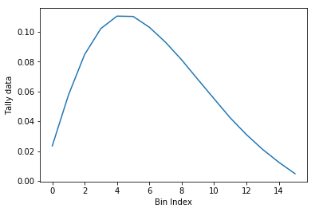

.. code:: 

    >>> ax = nodeFlx.plot(steps=True, label='steps')
    >>> ax = nodeFlx.plot(sigma=100, ax=ax, c='k', alpha=0.6, 
    ...                   marker='x', label='sigma')

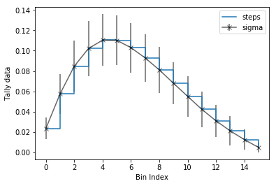

Passing ``what='errors'`` to the plot method plots the associated
relative errors, rather than the tally data on the y-axis. 
Similarly, passing a key from |DetIndx|
as the ``xdim`` argument sets the x-axis to be that specific index.

.. code:: 

    >>> nodeFlx.plot(xdim='universe', what='errors', 
    ...              ylabel='Relative tally error [%]')

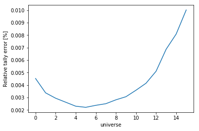

Mesh Plots
~~~~~~~~~~

For data with dimensionality greater than one, the |mesh| method
can be used to plot some 2D slice of the data on a Cartesian grid.
Passing a dictionary as the ``fixed`` argument restricts the tally data
down to two dimensions. The X and Y axis can be quantities from
|DetGrids| or |DetIndx|. If the quantity to be used for an axis is in
the |DetGrids| dictionary, then the appropriate spatial or energetic grid
from the detector file will be used. Otherwise, the axis will reflect
changes in a specific bin type. The following keyword arguments can be
used in conjunction with the above options to format the mesh plots.

+------------------+--------------------------------------------------------+
| Option           | Action                                                 |
+==================+========================================================+
| ``cmap``         | Colormap to apply to the figure                        |
+------------------+--------------------------------------------------------+
| ``cbarLabel``    | Label to apply to the colorbar                         |
+------------------+--------------------------------------------------------+
| ``logColor``     | If true, use a logarithmic scale for the colormap      |
+------------------+--------------------------------------------------------+
| ``normalizer``   | Apply a custom non-linear normalizer to the colormap   |
+------------------+--------------------------------------------------------+

The ``cmap`` argument must be something that ``matplotlib`` can
understand as a valid colormap. This can be a string of any of the
colormaps supported by :term:`matplotlib`.

Since the ``xymesh`` detector is three dimensions, (energy, x, and y),
we must pick an energy group to plot.

.. code:: 

    >>> xy.meshPlot('x', 'y', fixed={'energy': 0}, 
    ...             cbarLabel='Mesh-integrated flux $[n/cm^2/s]$',
    ...             title="Fast spectrum flux $[>0.625 eV]$");

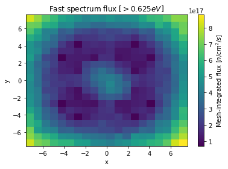

The |mesh| also supports a range of labeling and plot options.
Here, we attempt to plot the flux and U-235 fission reaction rate errors
as a function of energy, with the two reaction rates separated on the
y-axis. Passing ``logColor=True`` applies a logarithmic color scale to
all the positive data. Data that is zero is not shown, and errors will
be raised if the data contain negative quantities.

Here we also apply custom y-tick labels to reflect the reaction that is
being plotted.

.. code:: 

    >>> ax = spectrum.meshPlot('e', 'reaction', what='errors', 
    ...                        ylabel='Reaction type', cmap='PuBu_r',
    ...                        cbarLabel="Relative error $[\%]$",
    ...                        xlabel='Energy [MeV]', logColor=True,
    ...                        logx=True);
    >>> ax.set_yticks([0.5, 1.5]);
    >>> ax.set_yticklabels([r'$\psi$', r'$U-235 \sigma_f$'], rotation=90,
    >>>                    verticalalignment='center');

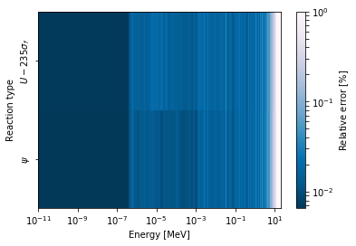

Using the ``slicing`` arguments allows access to the 1D plot methods
from before

.. code:: 

    >>> xy.plot(fixed={'energy': 1, 'xmesh': 1}, 
    ...         xlabel='Y position',
    ...         ylabel='Thermal flux along x={}'
    ...         .format(xy.grids['X'][1, 0]));

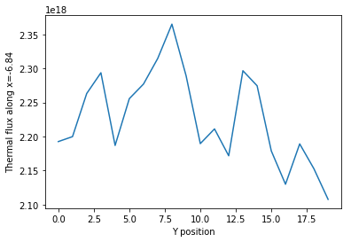

Spectrum Plots
~~~~~~~~~~~~~~

The |Detector| objects are also capable of energy spectrum plots, if
an associated energy grid is given. The ``normalize`` option will
normalize the data per unit lethargy. This plot takes some additional
assumptions with the scaling and labeling, but all the same controls as
the above line plots.

The |spectrum| method is designed to prepare plots of energy
spectra. Supported arguments for the |spectrum| method include

+-----------------+----------------+----------------------------------------------+
| Option          | Default        | Description                                  |
+=================+================+==============================================+
| ``normalize``   | ``True``       | Normalize tallies per unit lethargy          |
+-----------------+----------------+----------------------------------------------+
| ``fixed``       | ``None``       | Dictionary that controls matrix reduction    |
+-----------------+----------------+----------------------------------------------+
| ``sigma``       | 3              | Level of confidence for statistical errors   |
+-----------------+----------------+----------------------------------------------+
| ``xscale``      | ``'log'``      | Set the x scale to be log or linear          |
+-----------------+----------------+----------------------------------------------+
| ``yscale``      | ``'linear'``   | Set the y scale to be log or linear          |
+-----------------+----------------+----------------------------------------------+

The figure below demonstrates the default options and control in this
|spectrum| routine by

1. Using the less than helpful plot routine with no formatting
2. Using |spectrum| without normalization to show default labels
   and scaling
3. Using |spectrum| with normalization

Since our detector has energy bins and reaction bins, we need to reduce
down to one-dimension with the ``fixed`` command.

.. code:: 

    >>> fig, axes = pyplot.subplots(1, 3, figsize=(16, 4))
    >>> fix = {'reaction': 0}
    >>> spectrum.plot(fixed=fix, ax=axes[0]);
    >>> spectrum.spectrumPlot(fixed=fix, ax=axes[1], normalize=False);
    >>> spectrum.spectrumPlot(fixed=fix, ax=axes[2]);

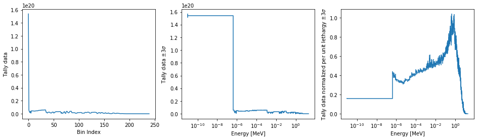

Multiple line plots
~~~~~~~~~~~~~~~~~~~

Plots can be made against multiple bins, such as spectrum in different
materials or reactions, with the |plot| and |spectrum| methods.
Below is the flux spectrum and spectrum of the U-235 fission reaction
rate from the same detector. The ``labels`` argument is what is used to
label each individual plot in the order of the bin index.

.. code:: 

    >>> labels = (
    ...     'flux',
    ...     r'$\sigma_f^{U-235}\psi$')  # render as mathtype
    >>> spectrum.plot(labels=labels, loglog=True);

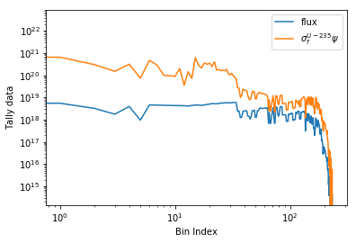

.. code:: 

    >>> spectrum.spectrumPlot(labels=labels, legend='above', ncol=2);

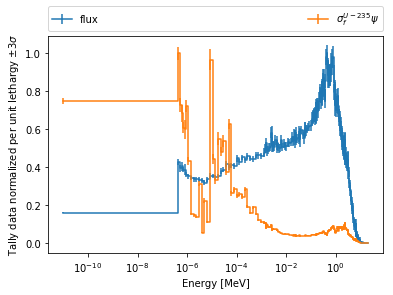

.. _ex-det-hex:

Hexagonal Detectors
-------------------

SERPENT allows the creation of hexagonal detectors with the ``dh`` card,
like::

    det hex2 2 0.0 0.0 1 5 5 0.0 0.0 1
    det hex3 3 0.0 0.0 1 5 5 0.0 0.0 1

which would create two hexagonal detectors with different orientations.
Type 2 detectors have two faces perpendicular to the x-axis, while type
3 detectors have faces perpendicular to the y-axis. For more
information, see the `dh card from SERPENT
wiki <http://serpent.vtt.fi/mediawiki/index.php/Input_syntax_manual#det_dh>`__.

``serpentTools`` is capable of storing data tallies and grid structures
from hexagonal detectors in
|hexDet| objects.

.. code:: 
    
    >>> hexFile = os.path.join(
    ...     os.environ["SERPENT_TOOLS_DATA"],
    ...     'hexplot_det0.m')
    >>> hexR = serpentTools.read(hexFile)
    >>> hexR.detectors
    {'hex2': <serpentTools.HexagonalDetector at 0x7f1ad03d5da0>,
    'hex3': <serpentTools.HexagonalDetector at 0x7f1ad03d5c88>}

Here, two |hexDet| objects are produced, with similar
|DetTallies| and slicing methods as demonstrated above.

.. code:: 
    
    >>> hex2 = hexR.detectors['hex2']
    >>> hex2.tallies
    array([[0.185251, 0.184889, 0.189381, 0.184545, 0.195442],
           [0.181565, 0.186038, 0.193088, 0.195448, 0.195652],
           [0.1856  , 0.190278, 0.192013, 0.193353, 0.184309],
           [0.186249, 0.191939, 0.192513, 0.194196, 0.186953],
           [0.198196, 0.198623, 0.195612, 0.174804, 0.178053]])
    >>> hex2.grids
    {'COORD': array([[-3.       , -1.732051 ],
            [-2.5      , -0.8660254],
            [-2.       ,  0.       ],
            [-1.5      ,  0.8660254],
            [-1.       ,  1.732051 ],
            [-2.       , -1.732051 ],
            [-1.5      , -0.8660254],
            [-1.       ,  0.       ],
            [-0.5      ,  0.8660254],
            [ 0.       ,  1.732051 ],
            [-1.       , -1.732051 ],
            [-0.5      , -0.8660254],
            [ 0.       ,  0.       ],
            [ 0.5      ,  0.8660254],
            [ 1.       ,  1.732051 ],
            [ 0.       , -1.732051 ],
            [ 0.5      , -0.8660254],
            [ 1.       ,  0.       ],
            [ 1.5      ,  0.8660254],
            [ 2.       ,  1.732051 ],
            [ 1.       , -1.732051 ],
            [ 1.5      , -0.8660254],
            [ 2.       ,  0.       ],
            [ 2.5      ,  0.8660254],
            [ 3.       ,  1.732051 ]]),
     'Z': array([[0., 0., 0.]])}
    >>> hex2.indexes
    ('ycoord', 'xcoord')

Creating hexagonal mesh plots with these objects requires setting the
:attr:`~serpentTools.HexagonalDetector.pitch`
and :attr:`~serpentTools.HexagonalDetector.hexType` attributes.

.. code:: 
    
    >>> hex2.pitch = 1
    >>> hex2.hexType = 2
    >>> hex2.hexPlot();

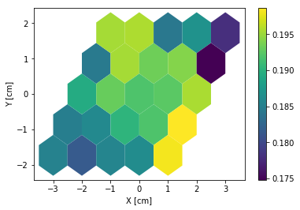

.. code:: 
    
    >>> hex3 = hexR.detectors['hex3']
    >>> hex3.pitch = 1
    >>> hex3.hexType = 3
    >>> hex3.hexPlot();

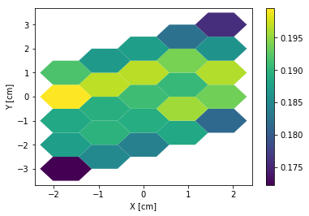

.. _ex-det-lim:

Limitations
-----------

``serpentTools`` does support reading detector files with hexagonal,
cylindrical, and spherical mesh structures.
However, creating 2D mesh plots with cylindrical and spherical detectors,
and utilizing their mesh structure, is not fully supported.
:issue:`169` is currently tracking progress for cylindrical plotting.

Conclusion
----------

The |DetectorReader| is capable of reading and storing detector data from SERPENT detector files.
The data is stored on custom |Detector|
objects, capable of reshaping tally and error matrices into arrays with
dimensionality reflecting the detector binning.
These |Detector| objects have simple methods for retrieving and plotting detector data.

References
----------

1. `matplotlib plot <https://matplotlib.org/api/_as_gen/matplotlib.pyplot.plot.html>`_
2. `Custom colormap normalization <https://matplotlib.org/gallery/userdemo/colormap_normalizations_custom.html#sphx-glr-gallery-userdemo-colormap-normalizations-custom-py>`_
3. `matplotlib 2.0 colormaps <https://matplotlib.org/examples/color/colormaps_reference.html>`_
