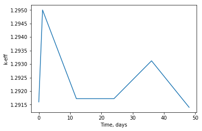
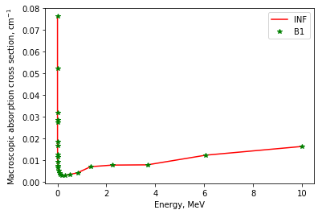
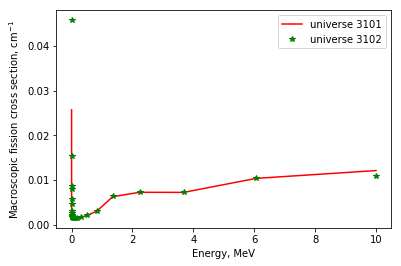

.. |resReader| replace:: :py:class:`~serpentTools.parsers.results.ResultsReader`

.. |homogUniv| replace:: :py:class:`~serpentTools.objects.containers.HomogUniv`

.. |getUniv| replace:: :py:meth:`~serpentTools.parsers.results.ResultsReader.getUniv`

.. |resdata| replace:: :py:attr:`~serpentTools.parsers.results.ResultsReader.resdata`

.. |metadata| replace:: :py:attr:`~serpentTools.parsers.results.ResultsReader.metadata`

.. |universes| replace:: :py:attr:`~serpentTools.parsers.results.ResultsReader.universes`

==============
Results Reader
==============

Basic operations
----------------

This notebook demonstrates the capabilities of the serpentTools to read
Serpent results files. SERPENT [1] produces a result file (i.e.
``_res.m``), containing general results (e.g. ``k-eff``), metadata (e.g.
``title``) and homogenized cross-sections. The homogenized cross-section
sets are printed in the results file for all the requested universes.
The |resReader| is capable of reading this file, and storing the data
inside |homogUniv| objects. Each such object has methods and attributes that
should ease the analyses.

.. code:: 
    
    >>> import numpy as np
    >>> import serpentTools
    >>> from serpentTools.settings import rc
    >>> rc['serpentVersion'] = '2.1.30'

.. code:: 
    
    >>> %time
    >>> resFile = 'InnerAssembly_res.m'
    >>> res = serpentTools.read(resFile)

.. parsed-literal::

    Wall time: 0 ns

Metadata (``metadata``)
=======================

|metadata| is a collective data that describes the problem. The
following data is included: titles, data paths, and other descriptive
data exist on the reader

.. code:: 

    >>> print(res.metadata['version'])  # Serpent version used for the execution
    >>> print(res.metadata['decayDataFilePath'])  # Directory path for data libraries
    >>> print(res.metadata['inputFileName'])  # Directory path for data libraries

.. parsed-literal::

    Serpent 2.1.30
    /nv/hp22/dkotlyar6/data/Codes/DATA/endfb7/sss_endfb7.dec
    InnerAssembly
    

Obtain all the variables in the metadata via ``.keys()``

.. code:: 

    >>> res.metadata.keys()

.. parsed-literal::
 
    dict_keys(['version', 'compileDate', 'debug', 'title', 'confidentialData',
    'inputFileName', 'workingDirectory', 'hostname', 'cpuType', 'cpuMhz',
    'startDate', 'completeDate', 'pop', 'cycles', 'skip', 'batchInterval',
    'srcNormMode', 'seed', 'ufsMode', 'ufsOrder', 'neutronTransportMode',
    'photonTransportMode', 'groupConstantGeneration', 'b1Calculation',
    'b1BurnupCorrection', 'implicitReactionRates', 'optimizationMode',
    'reconstructMicroxs', 'reconstructMacroxs', 'doubleIndexing', 'mgMajorantMode',
    'spectrumCollapse', 'mpiTasks', 'ompThreads', 'mpiReproducibility',
    'ompReproducibility', 'ompHistoryProfile', 'shareBufArray', 'shareRes2Array',
    'xsDataFilePath', 'decayDataFilePath', 'sfyDataFilePath', 'nfyDataFilePath',
    'braDataFilePath'])

.. code:: 
    
    >>> # Grep the value of a certain key, e.g. simulation start date
    >>> res.metadata['startDate']

.. parsed-literal::
 
    'Sat Apr 28 06:09:54 2018'

.. code:: 
    
    >>> # statistics used for the execution (histories, inactive and active cycles)
    >>> print(res.metadata['pop'], res.metadata['skip']  , res.metadata['cycles'])

.. parsed-literal::
 
    [ 5000.] [ 10.] [ 50.]

.. code:: 
    
    >>> # Obtain the version defined in the settings
    >>> print('User defined version: {}'.format(rc['serpentVersion']))
    >>> # Obtain the version actually used in the execution
    >>> print('Used version: {}'.format(res.metadata['version']))

.. parsed-literal::
 
    User defined version: 2.1.30
    Used version: Serpent 2.1.30

Results Data (``resdata``)
==========================

Results are stored as a function of time/burnup/index and include
integral parameters of the system. Results, such as ``k-eff``, total
``flux``, execution times are included in |resdata|. Some results
include values and uncertainities (e.g. criticality) and some just the
values (e.g. CPU resources).

.. code:: 
    
    >>> # All the variables can be obtained by using 'resdata.keys()'
    >>> AllVariables = res.resdata.keys() # contains all the variable as a dict_keys
    >>> # The example below shows only the first five variables in the resdata dictionary
    >>> list(AllVariables)[0:5]

.. parsed-literal::
 
    ['minMacroxs', 'dtThresh', 'stFrac', 'dtFrac', 'dtEff']

.. code:: 
    
    >>> # Time-dependent variables, such as k-eff, are stored in 'resdata'
    >>> print(res.resdata['absKeff'])  # Values (1st col.) + std (2nd col.) 

.. parsed-literal::

    [[  1.29160000e+00   9.00000000e-04]
     [  1.29500000e+00   9.30000000e-04]
     [  1.29172000e+00   9.10000000e-04]
     [  1.29172000e+00   7.80000000e-04]
     [  1.29312000e+00   6.80000000e-04]
     [  1.29140000e+00   7.80000000e-04]]
    

.. code:: 

    >>> # Obtain only the values for 'absKeff'
    >>> res.resdata['absKeff'][:,0]

.. parsed-literal::

    array([ 1.2916 ,  1.295  ,  1.29172,  1.29172,  1.29312,  1.2914 ])

.. code:: 

    >>> # Obtain only the uncertainties for 'absKeff'
    >>> res.resdata['absKeff'][:,1]

.. parsed-literal::

    array([ 0.0009 ,  0.00093,  0.00091,  0.00078,  0.00068,  0.00078])

.. code:: 

    >>> # Burnup data is not written by default, a burnup mode is defined within the input file
    >>> # Extract burnup related quantities
    >>> print(res.resdata['burnup']) # burnup intervals (MWd/kg) 
    >>> print(res.resdata['burnDays']) # time points (days)

.. parsed-literal::

    [[ 0.        0.      ]
     [ 0.1       0.100001]
     [ 1.        1.00001 ]
     [ 2.        2.00001 ]
     [ 3.        3.00003 ]
     [ 4.        4.00004 ]]
    [[  0.     ]
     [  1.20048]
     [ 12.0048 ]
     [ 24.0096 ]
     [ 36.0144 ]
     [ 48.0192 ]]
    

.. code:: 

    >>> # Some variables are stored with no uncertainties
    >>> print(res.resdata['totCpuTime']) # total CPU time,  

.. parsed-literal::

    [[ 10.814 ]
     [ 20.3573]
     [ 30.0783]
     [ 39.4965]
     [ 48.919 ]
     [ 58.6448]]
    

Plotting Results Data (|resdata|)
-----------------------------------

Basic 1-D plotting capabilities are not yet avaialble in the parser.

.. code:: 

    >>> %matplotlib inline
    >>> import matplotlib.pyplot as plt
    >>> xdata = res.resdata['burnDays'][:] # obtain the time in (days)
    >>> ydata = res.resdata['absKeff'][:,0] # obtain the k-eff (values only)
    >>> plt.plot(xdata, ydata)
    >>> plt.xlabel('Time, days'), plt.ylabel('k-eff')               

.. parsed-literal::

    (<matplotlib.text.Text at 0x1e4c9d8d400>,
     <matplotlib.text.Text at 0x1e4c9da4ac8>)

Universe Data (|universes|)
=============================

Universe data is stored for each state point, i.e.
``('univ',burnup, burnupIdx, time)``

| ``'univ'``: universe ID (e.g., ``'0'``), ``burnup``: in MWd/kg,
  ``burnupIdx``: step index, ``time``: in days.
| Results, such as infinite cross-sections, b1-leakage corrected
  cross-sections, kinetic parameters, are included in |universes|.
  All the results include values and uncertainties.

.. code:: 

    >>> # The different states are obtained by:
    >>> res.universes.keys()
    >>> # The next cell presents the various unique states ('univ',burnup, burnupIdx, time)

.. parsed-literal::
 
    dict_keys([('3101', 0.0, 1, 0.0), ('3102', 0.0, 1, 0.0), ('0', 0.0, 1, 0.0),
    ('3101', 0.10000000000000001, 2, 1.20048), ('3102', 0.10000000000000001, 2,
    1.20048), ('0', 0.10000000000000001, 2, 1.20048), ('3101', 1.0, 3,
    12.004799999999999), ('3102', 1.0, 3, 12.004799999999999), ('0', 1.0, 3,
    12.004799999999999), ('3101', 2.0, 4, 24.009599999999999), ('3102', 2.0, 4,
    24.009599999999999), ('0', 2.0, 4, 24.009599999999999), ('3101', 3.0, 5,
    36.014400000000002), ('3102', 3.0, 5, 36.014400000000002), ('0', 3.0, 5,
    36.014400000000002), ('3101', 4.0, 6, 48.019199999999998), ('3102', 4.0, 6,
    48.019199999999998), ('0', 4.0, 6, 48.019199999999998)])

.. code:: 

    >>> # Let's use the following unique state
    >>> print(res.universes[('3102', 0.0, 1, 0.0)])

.. parsed-literal::

    <HomogUniv 3102: burnup: 0.000 MWd/kgu, step: 1, 0.000 days>
    

Each state contains the same data fields, which can be obtained by using
a specific state point:

``.infExp``: infinite values, e.g. ``INF_ABS``,

``.infUnc``: infinite uncertainties,

``.b1Exp``: b1 (leakage corrected) values, e.g. ``B1_ABS``,

``.b1Exp``: b1 (leakage corrected) uncertainties,

``.gc``: variables that are not included in 'inf' or 'b1', e.g. ``BETA``

``.gcUnc``: group uncertainties

``.groups``: macro energy group structure, MeV

``.microGroups``: micro energy group structure, MeV

http://serpent-tools.readthedocs.io/en/latest/api/containers.html#serpentTools.objects.containers.HomogUniv

Get Universe Data (``.getUniv``)
--------------------------------

The |getUniv| method obtains the data for a specific universe and time of
interest. In order to obtain the data, the user needs to pass the
``universe id`` and the ``time point``:

``.getUniv(univ, burnup, index, time)``

``univ`` must be a string ``burnup`` is a float or int with the units
MWd/kgU ``time`` is a float or int with the units Days ``index`` is a
positive integer (i.e. 1, 2, ...)

The method requires to insert the universe and burnup or time or index
(only one of these is actually used to retrieve the data). If more than
one time parameter is given, the hierarchy of search is: index (highest
priority), burnup, time (lowest priority)

.. code:: 
    
    >>> # Examples to use various time entries
    >>> univ3101 = res.getUniv('3101', index=4) # obtain the results for universe=3101 and index=4 
    >>> univ3102 = res.getUniv('3102', burnup=0.1) # obtain the results for universe=3102 and index=0.1 MWd/kgU
    >>> univ0 = res.getUniv('0', timeDays=24.0096) # obtain the results for universe=0 and index=24.0096 days

.. code:: 
    
    >>> # The full states are printed below
    >>> print(univ3101)
    >>> print(univ3102)
    >>> print(univ0)

.. parsed-literal::
 
    <HomogUniv 3101: burnup: 2.000 MWd/kgu, step: 4, 24.010 days>
    <HomogUniv 3102:
    burnup: 0.100 MWd/kgu, step: 2, 1.200 days>
    <HomogUniv 0: burnup: 2.000
    MWd/kgu, step: 4, 24.010 days>

.. code:: 
    
    >>> # obtain the results for universe=0 and index=1 (burnup and timeDays are inserted but not used)
    >>> univ0 = res.getUniv('0', burnup=0.0, index=1, timeDays=0.0)  
    >>> print(univ0)

.. parsed-literal::
 
    <HomogUniv 0: burnup: 0.000 MWd/kgu, step: 1, 0.000 days>

.. code:: 
    
    >>> # The parser reads all the variables by default
    >>> # Each field is a dictionary, with variables as keys and corresponding values.
    >>> univ0.infExp.keys() # obtain all the variables stored in 'infExp' field

.. parsed-literal::
 
    dict_keys(['infMicroFlx', 'infKinf', 'infFlx', 'infFissFlx', 'infTot',
    'infCapt', 'infAbs', 'infFiss', 'infNsf', 'infNubar', 'infKappa', 'infInvv',
    'infScatt0', 'infScatt1', 'infScatt2', 'infScatt3', 'infScatt4', 'infScatt5',
    'infScatt6', 'infScatt7', 'infScattp0', 'infScattp1', 'infScattp2',
    'infScattp3', 'infScattp4', 'infScattp5', 'infScattp6', 'infScattp7',
    'infTranspxs', 'infDiffcoef', 'infRabsxs', 'infRemxs', 'infI135Yield',
    'infXe135Yield', 'infPm147Yield', 'infPm148Yield', 'infPm148mYield',
    'infPm149Yield', 'infSm149Yield', 'infI135MicroAbs', 'infXe135MicroAbs',
    'infPm147MicroAbs', 'infPm148MicroAbs', 'infPm148mMicroAbs',
    'infPm149MicroAbs', 'infSm149MicroAbs', 'infXe135MacroAbs', 'infSm149MacroAbs',
    'infChit', 'infChip', 'infChid', 'infS0', 'infS1', 'infS2', 'infS3', 'infS4',
    'infS5', 'infS6', 'infS7', 'infSp0', 'infSp1', 'infSp2', 'infSp3', 'infSp4',
    'infSp5', 'infSp6', 'infSp7'])

.. code:: 
    
    >>> # The values are all energy dependent 
    >>> univ0.infExp['infAbs'] # obtain the infinite macroscopic xs for ('0', 0.0, 1, 0.0)

.. parsed-literal::
 
    array([ 0.0170306 ,  0.0124957 ,  0.00777066,  0.00773255,  0.00699608,
    0.00410746,  0.00334604,  0.00296948,  0.0030725 ,  0.00335412,
    0.00403133,  0.00506587,  0.00651475,  0.00737292,  0.00907442,
    0.0113446 ,  0.0125896 ,  0.0164987 ,  0.0181642 ,  0.0266464 ,
    0.0292439 ,  0.0315338 ,  0.0463069 ,  0.0807952 ])

.. code:: 
    
    >>> # Obtain the infinite flux for ('0', 0.0, 1, 0.0)
    >>> univ0.infExp['infFlx']

.. parsed-literal::
 
    array([  1.10460000e+15,   1.72386000e+16,   7.78465000e+16,
    1.70307000e+17,   2.85783000e+17,   4.61226000e+17,
             8.04999000e+17,
    1.17536000e+18,   1.17488000e+18,
             1.26626000e+18,   1.03476000e+18,
    7.58885000e+17,
             4.95687000e+17,   5.85369000e+17,   2.81921000e+17,
    1.16665000e+17,   8.06833000e+16,   2.26450000e+16,
             6.51541000e+16,
    2.79929000e+16,   8.87468000e+15,
             1.70822000e+15,   8.87055000e+14,
    6.22266000e+13])

.. code:: 
    
    >>> # Uncertainties can be obtained in a similar was by using the 'infUnc' field. 
    >>> # The variables will be identical to those defined in 'infExp'
    >>> univ0.infUnc['infFlx'] # obtain the relative uncertainty

.. parsed-literal::

    array([  1.10460000e+15,   1.72386000e+16,   7.78465000e+16,
             1.70307000e+17,   2.85783000e+17,   4.61226000e+17,
             8.04999000e+17,   1.17536000e+18,   1.17488000e+18,
             1.26626000e+18,   1.03476000e+18,   7.58885000e+17,
             4.95687000e+17,   5.85369000e+17,   2.81921000e+17,
             1.16665000e+17,   8.06833000e+16,   2.26450000e+16,
             6.51541000e+16,   2.79929000e+16,   8.87468000e+15,
             1.70822000e+15,   8.87055000e+14,   6.22266000e+13])

.. code:: 
    
    >>> # Uncertainties can be obtained in a similar was by using the 'infUnc' field. 
    >>> # The variables will be identical to those defined in 'infExp'
    >>> univ0.infUnc['infFlx'] # obtain the relative uncertainty

.. parsed-literal::

    array([ 0.02125,  0.0287 ,  0.00901,  0.00721,  0.00441,  0.00434,
            0.00448,  0.0007 ,  0.00369,  0.00071,  0.00045,  0.00133,
            0.00061,  0.00341,  0.00674,  0.00197,  0.00802,  0.00368,
            0.00127,  0.00046,  0.02806,  0.0491 ,  0.19529,  0.16476])

Serpent also outputs the ``B1`` cross-sections. However, the user must
enable the ``B1`` option by setting the ``fum`` card:
http://serpent.vtt.fi/mediawiki/index.php/Input\_syntax\_manual#set\_fum

If this card is not enabled by the user, the ``B1_`` variables will all
be zeros.

.. code:: 
    
    >>> # The parser reads all the variables by default
    >>> # Each field is a dictionary, with variables as keys and corresponding values.
    >>> univ0.b1Exp.keys() # obtain all the variables stored in 'b1Exp' field

.. parsed-literal::
 
    dict_keys(['b1MicroFlx', 'b1Kinf', 'b1Keff', 'b1B2', 'b1Err', 'b1Flx',
    'b1FissFlx', 'b1Tot', 'b1Capt', 'b1Abs', 'b1Fiss', 'b1Nsf', 'b1Nubar',
    'b1Kappa', 'b1Invv', 'b1Scatt0', 'b1Scatt1', 'b1Scatt2', 'b1Scatt3',
    'b1Scatt4', 'b1Scatt5', 'b1Scatt6', 'b1Scatt7', 'b1Scattp0', 'b1Scattp1',
    'b1Scattp2', 'b1Scattp3', 'b1Scattp4', 'b1Scattp5', 'b1Scattp6', 'b1Scattp7',
    'b1Transpxs', 'b1Diffcoef', 'b1Rabsxs', 'b1Remxs', 'b1I135Yield',
    'b1Xe135Yield', 'b1Pm147Yield', 'b1Pm148Yield', 'b1Pm148mYield',
    'b1Pm149Yield', 'b1Sm149Yield', 'b1I135MicroAbs', 'b1Xe135MicroAbs',
    'b1Pm147MicroAbs', 'b1Pm148MicroAbs', 'b1Pm148mMicroAbs', 'b1Pm149MicroAbs',
    'b1Sm149MicroAbs', 'b1Xe135MacroAbs', 'b1Sm149MacroAbs', 'b1Chit', 'b1Chip',
    'b1Chid', 'b1S0', 'b1S1', 'b1S2', 'b1S3', 'b1S4', 'b1S5', 'b1S6', 'b1S7',
    'b1Sp0', 'b1Sp1', 'b1Sp2', 'b1Sp3', 'b1Sp4', 'b1Sp5', 'b1Sp6', 'b1Sp7'])

.. code:: 
    
    >>> # Obtain the b1 fluxes for ('3101', 0.0, 1, 0.0)
    >>> univ3101.b1Exp['b1Flx']

.. parsed-literal::

    array([  1.20660000e+15,   1.65202000e+16,   7.47956000e+16,
             1.62709000e+17,   2.74814000e+17,   4.22295000e+17,
             7.04931000e+17,   9.70795000e+17,   9.11899000e+17,
             9.33758000e+17,   7.23255000e+17,   5.00291000e+17,
             3.16644000e+17,   3.52049000e+17,   1.62308000e+17,
             6.68674000e+16,   4.47932000e+16,   1.23599000e+16,
             3.51299000e+16,   1.46504000e+16,   4.38516000e+15,
             7.96971000e+14,   3.54233000e+14,   2.11013000e+13])

.. code:: 
    
    >>> # Obtain the b1 fluxes for ('3101', 0.0, 1, 0.0)
    >>> univ3101.b1Exp['b1Abs']

.. parsed-literal::

    array([ 0.0162779 ,  0.0122552 ,  0.00779406,  0.00767857,  0.00694392,
            0.00412055,  0.00334267,  0.00296283,  0.00306196,  0.00335034,
            0.00403083,  0.00506224,  0.00652214,  0.00737463,  0.00906819,
            0.011397  ,  0.0125957 ,  0.0167696 ,  0.0184019 ,  0.0274004 ,
            0.0286808 ,  0.0318976 ,  0.0522545 ,  0.0763042 ])

Data that does not contain the prefix ``INF_`` or ``B1_`` is stored
under the ``gc`` and ``gcUnc`` fields.

Criticality, kinetic, and other variables are stored under this field.

.. code:: 
    
    >>> univ3101.gc.keys() # obtain all the variables stored in 'gc' field

.. parsed-literal::
 
    dict_keys(['cmmTranspxs', 'cmmTranspxsX', 'cmmTranspxsY', 'cmmTranspxsZ',
    'cmmDiffcoef', 'cmmDiffcoefX', 'cmmDiffcoefY', 'cmmDiffcoefZ', 'betaEff',
    'lambda'])

.. code:: 
    
    >>> # The data included in the 'gc' field contains only the values (no uncertainties)
    >>> univ3101.gc['betaEff'] # obtain beta-effective

.. parsed-literal::

    array([  3.04272000e-03,   8.93131000e-05,   6.59324000e-04,
             5.62858000e-04,   1.04108000e-03,   5.67326000e-04,
             1.22822000e-04])

``Macro`` and ``Micro`` energy group structures are stored directly in
the universe.

.. code:: 

    >>> # Obtain the macro energy structure in MeV
    >>> univ3101.groups

.. parsed-literal::

    array([  1.00000000e+37,   1.00000000e+01,   6.06530000e+00,
             3.67880000e+00,   2.23130000e+00,   1.35340000e+00,
             8.20850000e-01,   4.97870000e-01,   3.01970000e-01,
             1.83160000e-01,   1.11090000e-01,   6.73800000e-02,
             4.08680000e-02,   2.47880000e-02,   1.50340000e-02,
             9.11880000e-03,   5.53090000e-03,   3.35460000e-03,
             2.03470000e-03,   1.23410000e-03,   7.48520000e-04,
             4.54000000e-04,   3.12030000e-04,   1.48940000e-04,
             0.00000000e+00])

.. code:: 

    >>> # Obtain the micro energy structure in MeV
    >>> univ3101.microGroups[:5:] # print only the five first values

.. parsed-literal::

    array([  1.00000000e-10,   1.48940000e-04,   1.65250000e-04,
             1.81560000e-04,   1.97870000e-04])

Plotting universes
------------------

.. code:: 
    
    >>> # obtain the energy grid in descending order (high to low energy)
    >>> xdata = univ3101.groups[1:] 
    >>> # obtain the inifinite abs. xs
    >>> ydataInf = univ3101.infExp['infAbs']
    >>> ydataB1 = univ3101.b1Exp['b1Abs']

.. code:: 
    
    >>> plt.plot(xdata, ydataInf,'r', label='INF')
    >>> plt.plot(xdata, ydataB1,'*g', label='B1')
    >>> plt.legend()
    >>> plt.xlabel('Energy, MeV'), plt.ylabel('Macroscopic absorption cross section, cm$^{-1}$')  

.. parsed-literal::
 
    (<matplotlib.text.Text at 0x1e4ca0c8a20>,
     <matplotlib.text.Text at
    0x1e4ca334cf8>)

.. code:: 

    >>> # obtain the energy grid in descending order (high to low energy)
    >>> xdata = univ3101.groups[1:] 
    >>> # obtain the inifinite fiss. xs
    >>> ydata3101 = univ3101.infExp['infFiss'] # for universe 3101 and index=2
    >>> ydata3102 = univ3102.infExp['infFiss'] # for universe 3102 and index=4

.. code:: 

    >>> plt.plot(xdata, ydata3101,'r', label='universe 3101')
    >>> plt.plot(xdata, ydata3102,'*g', label='universe 3102')
    >>> plt.legend()
    >>> plt.xlabel('Energy, MeV'), plt.ylabel('Macroscopic fission cross section, cm$^{-1}$')  

.. parsed-literal::

    (<matplotlib.text.Text at 0x1e4ca430ef0>,
     <matplotlib.text.Text at 0x1e4ca40e9e8>)

User Defined Settings
---------------------

The user is able to filter the required information by using the
settings option.

A detailed description on how to use the settings can be found on:
http://serpent-tools.readthedocs.io/en/latest/settingsTop.html

.. code:: 

    >>> # Setting are all defined in 'rc'
    >>> from serpentTools.settings import rc

.. code:: 

    >>> # Obtain the user defined keys
    >>> rc.keys()

.. parsed-literal::
 
    dict_keys(['branching.areUncsPresent', 'branching.intVariables',
    'branching.floatVariables', 'depletion.metadataKeys',
    'depletion.materialVariables', 'depletion.materials', 'depletion.processTotal',
    'detector.names', 'verbosity', 'sampler.allExist', 'sampler.freeAll',
    'sampler.raiseErrors', 'sampler.skipPrecheck', 'serpentVersion', 'xs.getInfXS',
    'xs.getB1XS', 'xs.reshapeScatter', 'xs.variableGroups', 'xs.variableExtras'])

The user can modify the settings and only then use |resReader|

.. code:: 
    
    >>> # Change the serpent version to 2.1.30
    >>> versionOriginal = rc['serpentVersion']
    >>> print('The version defined by default is {}'.format(versionOriginal)) # print the original version
    >>> rc['serpentVersion'] = '2.1.30'
    >>> print('The version set by the user is {}'.format(rc['serpentVersion'] )) # print the modified version

.. parsed-literal::
 
    The version defined by default is 2.1.30
    The version set by the user is 2.1.30

.. code:: 
    
    >>> # Explicitly state which groups of variables should be stored
    >>> # The variables for these groups are defined according to the .yaml file
    >>> rc['xs.variableGroups'] = ['versions', 'xs', 'eig', 'burnup-coeff']

.. code:: 
    
    >>> # The user can state which cross-sections to store
    >>> rc['xs.getInfXS'] = True # Obtain the infinite xs
    >>> rc['xs.getB1XS'] = False # Do not store the leakage corrected xs

.. code:: 
    
    >>> # Read the file again with the updated settings
    >>> resFilt = serpentTools.read(resFile)

.. code:: 
    
    >>> # Print all the stored variables in metadata
    >>> resFilt.metadata.keys()

.. parsed-literal::
 
    dict_keys(['version', 'compileDate', 'debug', 'title', 'confidentialData',
    'inputFileName', 'workingDirectory', 'hostname', 'cpuType', 'cpuMhz',
    'startDate', 'completeDate'])

.. code:: 
    
    >>> # All the variables can be obtained by using 'resdata.keys()'
    >>> resFilt.resdata.keys() # contains all the variable as a dict_keys

.. parsed-literal::
 
    dict_keys(['burnMaterials', 'burnMode', 'burnStep', 'burnup', 'burnDays',
    'nubar', 'anaKeff', 'impKeff', 'colKeff', 'absKeff', 'absKinf', 'geomAlbedo'])

.. code:: 
    
    >>> # obtain the results for universe=0 and index=1 (burnup and timeDays are inserted but not used)
    >>> univ0Filt = resFilt.getUniv('0', burnup=0.0, index=1, timeDays=0.0)  

.. code:: 
    
    >>> # Obtain all the variables stored in 'infExp' field
    >>> univ0Filt.infExp.keys() 

.. parsed-literal::
 
    dict_keys(['infCapt', 'infAbs', 'infFiss', 'infNsf', 'infNubar', 'infKappa',
    'infInvv', 'infScatt0', 'infScatt1', 'infScatt2', 'infScatt3', 'infScatt4',
    'infScatt5', 'infScatt6', 'infScatt7', 'infTranspxs', 'infDiffcoef',
    'infRabsxs', 'infRemxs', 'infChit', 'infChip', 'infChid', 'infS0', 'infS1',
    'infS2', 'infS3', 'infS4', 'infS5', 'infS6', 'infS7'])

.. code:: 
    
    >>> # Obtain all the variables stored in 'gc' field
    >>> univ0Filt.gc.keys() 

.. parsed-literal::
 
    dict_keys([])

Conclusion
----------

The |resReader| is capable of reading and storing all the data
from the SERPENT ``_res.m`` file. Upon reading, the reader creates
custom |homogUniv| objects that are responsible for storing the universe 
related data. In addition, |metadata| and |resdata| are stored on the reader. 
These objects also have a handy |getUniv| method for
quick analysis of results corresponding to a specific universe and time point. 
Use of the 
:py:class:`~serpentTool.settings.rc` settings control object allows
increased control over the data selected from the output file.

References
----------

1. J. Leppänen, M. Pusa, T. Viitanen, V. Valtavirta, and T.
   Kaltiaisenaho. "The Serpent Monte Carlo code: Status, development and
   applications in 2013." Ann. Nucl. Energy, `82 (2015)
   142-150 <https://www.sciencedirect.com/science/article/pii/S0306454914004095>`_
