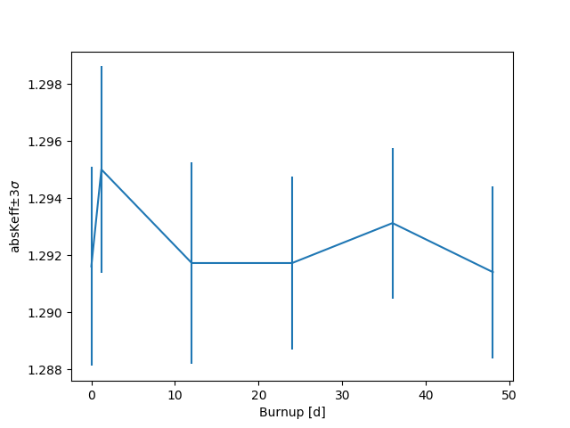
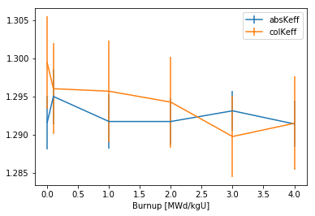
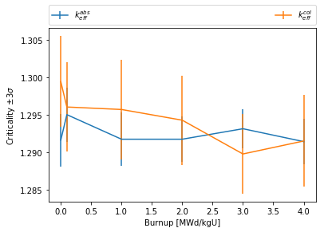
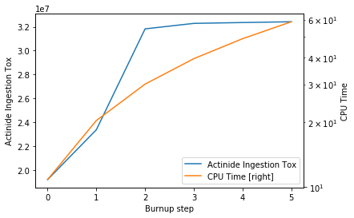
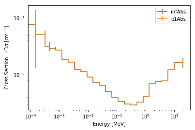
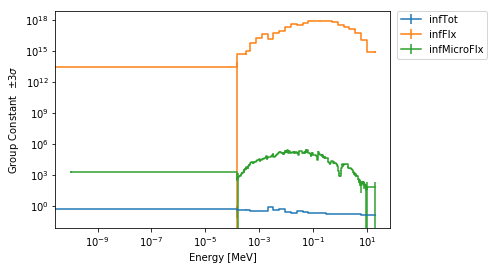
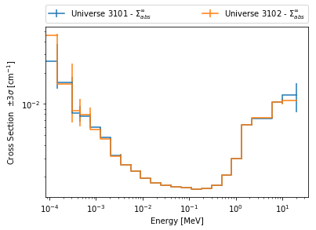

.. |getUniv| replace:: :meth:`~serpentTools.ResultsReader.getUniv`
.. |resdata| replace:: :attr:`~serpentTools.ResultsReader.resdata`
.. |metadata| replace:: :attr:`~serpentTools.ResultsReader.metadata`
.. |universes| replace:: :attr:`~serpentTools.ResultsReader.universes`

.. _ex-results:

.. note::

    Data files, like the one used in this example, are not included with the
    python distribution. They can be downloaded from the GitHub repository,
    and accessed after setting the ``SERPENT_TOOLS_DATA`` environment
    variable

.. code::

    >>> import os
    >>> resFile = os.path.join(
    ...     os.environ["SERPENT_TOOLS_DATA"],
    ...     "InnerAssembly_res.m")

==============
Results Reader
==============

Basic operations
----------------

This notebook demonstrates the capabilities of the serpentTools to read
Serpent results files. SERPENT [serpent]_ produces a result file (i.e.
``_res.m``), containing general results (e.g. ``k-eff``), metadata (e.g.
``title``) and homogenized cross-sections. The homogenized cross-section
sets are printed in the results file for all the requested universes.
The |ResultsReader| is capable of reading this file, and storing the data
inside |HomogUniv| objects. Each such object has methods and attributes that
should ease the analyses.

.. code:: 
    
    >>> import numpy as np
    >>> import serpentTools
    >>> res = serpentTools.read(resFile)

Metadata
========

|metadata| is a collective data that describes the problem. These are values
that do not change over burnup and across homogenized universes. The
following data is included: titles, data paths, and other descriptive
data exist on the reader

.. code:: 

    >>> print(res.metadata['version'])
    Serpent 2.1.30
    >>> print(res.metadata['decayDataFilePath'])
    /nv/hp22/dkotlyar6/data/Codes/DATA/endfb7/sss_endfb7.dec
    >>> print(res.metadata['inputFileName'])
    InnerAssembly
    >>> res.metadata.keys()
    dict_keys(['version', 'compileDate', 'debug', 'title', 'confidentialData',
    'inputFileName', 'workingDirectory', 'hostname', 'cpuType', 'cpuMhz',
    'startDate', 'completeDate', 'pop', 'cycles', 'skip', 'batchInterval',
    'srcNormMode', 'seed', 'ufsMode', 'ufsOrder', 'neutronTransportMode',
    'photonTransportMode', 'groupConstantGeneration', 'b1Calculation',
    'b1BurnupCorrection', 'implicitReactionRates', 'optimizationMode',
    'reconstructMicroxs', 'reconstructMacroxs', 'doubleIndexing', 'mgMajorantMode',
    'spectrumCollapse', 'mpiTasks', 'ompThreads', 'mpiReproducibility',
    'ompReproducibility', 'ompHistoryProfile', 'shareBufArray', 'shareRes2Array',
    'xsDataFilePath', 'decayDataFilePath', 'sfyDataFilePath', 'nfyDataFilePath',
    'braDataFilePath'])
    >>> res.metadata['startDate']
    'Sat Apr 28 06:09:54 2018'
    >>> res.metadata['pop'], res.metadata['skip']  , res.metadata['cycles']
    (5000, 10, 50)

Results Data
============

Results are stored as a function of time/burnup/index and include
integral parameters of the system. Results, such as ``k-eff``, total
``flux``, and execution times are included in |resdata|. Some results
include values and uncertainties (e.g. criticality) and some just the
values (e.g. CPU resources).

.. code:: 

    >>> list(res.resdata.keys())[0:5]
    ['minMacroxs', 'dtThresh', 'stFrac', 'dtFrac', 'dtEff']

Values are presented in similar fashion as if they were read in to Matlab, with one
exception. Serpent currently appends a new row for each burnup step, but also for
each set of homogenized universe. This results in repetition of many quantities
as Serpent loops over group constant data. The |ResultsReader| understands Serpent
outputs and knows when to append "new" data to avoid repetition.

The structure of the data is otherwise identical to Matlab. For many quantities,
the first column contains expected values, and the second column contains relative
uncertainties.

.. code::

    >>> res.resdata['absKeff'])
    array([[  1.29160000e+00, 9.00000000e-04],
           [  1.29500000e+00, 9.30000000e-04],
           [  1.29172000e+00, 9.10000000e-04],
           [  1.29172000e+00, 7.80000000e-04],
           [  1.29312000e+00, 6.80000000e-04],
           [  1.29140000e+00, 7.80000000e-04]]
    >>> res.resdata['absKeff'][:,0]
    array([ 1.2916 ,  1.295  ,  1.29172,  1.29172,  1.29312,  1.2914 ])

    >>> res.resdata['burnup']
    array([[ 0.      , 0.      ],
           [ 0.1     , 0.100001],
           [ 1.      , 1.00001 ],
           [ 2.      , 2.00001 ],
           [ 3.      , 3.00003 ],
           [ 4.      , 4.00004 ]]
    >>> res.resdata['burnDays']
    [[  0.     ],
     [  1.20048],
     [ 12.0048 ],
     [ 24.0096 ],
     [ 36.0144 ],
     [ 48.0192 ]]
    
Plotting Results Data
---------------------

The |ResultsReader| has a versatile
:meth:`~serpentTools.ResultsReader.plot` method,
used to plot primary time-dependent data from the result file.
One can plot data from one or more quantities against various
metrics of time. Control over axis formatting, legend placement,
and label formatting is easily yielded to the user.

.. code::

   >>> res.plot('absKeff')

.. code::

   >>> res.plot('burnup', ['absKeff', 'colKeff'])

Pass a dictionary of ``variable: label`` pairs to set plot labels.

.. code:: 

   >>> res.plot(
   >>>   'burnup', {
   >>>       'absKeff': '$k_{eff}^{abs}$',
   >>>       'colKeff': '$k_{eff}^{col}$',},
   >>>   ylabel=r'Criticality $\pm 3\sigma$',
   >>>   legend='above', ncol=2,
   >>>   )

Using the ``right`` argument, quantities can be plotted using the 
left and right y-axis. Similar formatting options are available.

.. code::

   >>> res.plot(
   >>>   'burnStep',
   >>>   {'actinideIngTox': 'Actinide Ing. Tox'},
   >>>   right={'totCpuTime': 'CPU Time [right]'},
   >>>   sigma=0, rightlabel="CPU Time",
   >>>   # set the yscale to log only of right axis
   >>>   logy=[False, True],
   >>>   )

Universe Data
=============

Universe data is stored for each state point in the |universes| dictionary. Keys are
:class:`~serpentTools.objects.UnivTuple` representing ``('univ',burnup, burnupIdx, time)``

- ``'univ'``: universe ID (e.g., ``'0'``)
- ``burnup``: in MWd/kg,
- ``burnupIdx``: step index
- ``time``: in days

and can be indexed by attribute or by position.

.. code::

    >>> for key in sorted(res.universes):
    ...     break
    >>> key
    UnivTuple(universe='0', burnup=0.0, step=0, days=0.0)
    >>> key[0]
    '0'
    >>> key.burnup == key[1]
    True
  
Results, such as infinite cross-sections, b1-leakage corrected
cross-sections, kinetic parameters, are included in |universes|.
All the results include values and uncertainties.

.. code:: 

    >>> res.universes.keys()
    dict_keys([
        UnivTuple(universe='3101', burnup=0.0, step=0, days=0.0),
        UnivTuple(universe='3102', burnup=0.0, step=0, days=0.0),
        UnivTuple(universe='0', burnup=0.0, step=0, days=0.0),
        UnivTuple(universe='3101', burnup=0.1, step=1, days=1.20048),
        UnivTuple(universe='3102', burnup=0.1, step=1, days=1.20048),
        ...
        UnivTuple(universe='3101', burnup=4.0, step=5, days=48.0192),
        UnivTuple(universe='3102', burnup=4.0, step=5, days=48.0192),
        UnivTuple(universe='0', burnup=4.0, step=5, days=48.0192)])

One can directly index into |universes| to obtain a specific |HomogUniv|
object::

    >>> print(res.universes['0', 0, 0, 0])
    <HomogUniv 0: burnup: 0.00000E+00 MWd/kgU, 0.00000E+00 days>

However, this requires knowledge of all four parameters, which may be difficult. 
The |getUniv| method retrieves the first universe that matches a set of parameters,
the universe and at least one point in time. While all four identifiers (universe id,
burnup, step, and time) can be provided, the latter three are usually redundant.

.. code:: 
    
    >>> univ0 = res.getUniv('0', timeDays=24.0096)
    >>> print(univ0)
    <HomogUniv 0: burnup: 0.00000E+00 MWd/kgU, 0.00000E+00 days>
    >>> univ3101 = res.getUniv('3101', index=3)
    >>> print(univ3101)
    <HomogUniv 3101: burnup: 2.00000E+00 MWd/kgU, 2.40096E+01 days>
    >>> univ3102 = res.getUniv('3102', burnup=0.1)
    >>> print(univ3102)
    <HomogUniv 3102: burnup: 1.00000E-01 MWd/kgU, 1.20048E+00 days>
    

Working with homogenized universe data
--------------------------------------

Each state contains the same data fields, which can be obtained by using
the following attributes on the |HomogUniv| object:

- |HomogUniv-infExp|: infinite values, e.g. ``INF_ABS``
- |HomogUniv-infUnc|: infinite uncertainties
- |HomogUniv-b1Exp|: b1 (leakage corrected) values, e.g. ``B1_ABS``
- |HomogUniv-b1Unc|: b1 (leakage corrected) uncertainties
- |HomogUniv-gc|: variables that are not included in ``inf`` or ``b1``, e.g. ``BETA``
- |HomogUniv-gcUnc|: uncertainties for quantities in |HomogUniv-gc|
- :attr:`~serpentTools.objects.HomogUniv.groups`: macro energy group structure, MeV
- :attr:`~serpentTools.objects.HomogUniv.microGroups`: micro energy group structure, MeV

The parser reads all the variables by default.
The values are all energy dependent in the order they would appear in the results file::

    >>> univ0.infExp.keys()
    dict_keys(['infMicroFlx', 'infKinf', 'infFlx', 'infFissFlx', 'infTot',
    'infCapt', 'infAbs', 'infFiss', 'infNsf', 'infNubar', 'infKappa', 'infInvv',
    'infScatt0', 'infScatt1', 'infScatt2', 'infScatt3', 'infScatt4', 'infScatt5',
    'infScatt6', 'infScatt7', 'infScattp0', 'infScattp1', 'infScattp2',
    'infScattp3', 'infScattp4', 'infScattp5', 'infScattp6', 'infScattp7',
    'infTranspxs', 'infDiffcoef', 'infRabsxs', 'infRemxs', 'infI135Yield',
    'infXe135Yield', 'infPm147Yield', 'infPm148Yield', 'infPm148mYield',
    'infPm149Yield', 'infSm149Yield', 'infI135MicroAbs', 'infXe135MicroAbs',
    'infPm147MicroAbs', 'infPm148MicroAbs', 'infPm148mMicroAbs',
    'infPm149MicroAbs', 'infSm149MicroAbs', 'infXe135MacroAbs', 'infSm149MacroAbs',
    'infChit', 'infChip', 'infChid', 'infS0', 'infS1', 'infS2', 'infS3', 'infS4',
    'infS5', 'infS6', 'infS7', 'infSp0', 'infSp1', 'infSp2', 'infSp3', 'infSp4',
    'infSp5', 'infSp6', 'infSp7'])

    >>> univ0.infExp['infAbs']
    array([ 0.0170306 ,  0.0124957 ,  0.00777066,  0.00773255,  0.00699608,
            0.00410746,  0.00334604,  0.00296948,  0.0030725 ,  0.00335412,
            0.00403133,  0.00506587,  0.00651475,  0.00737292,  0.00907442,
            0.0113446 ,  0.0125896 ,  0.0164987 ,  0.0181642 ,  0.0266464 ,
            0.0292439 ,  0.0315338 ,  0.0463069 ,  0.0807952 ])

    >>> univ0.infExp['infFlx']
    array([  1.10460000e+15,   1.72386000e+16,   7.78465000e+16,
             1.70307000e+17,   2.85783000e+17,   4.61226000e+17,
             8.04999000e+17,   1.17536000e+18,   1.17488000e+18,
             1.26626000e+18,   1.03476000e+18,   7.58885000e+17,
             4.95687000e+17,   5.85369000e+17,   2.81921000e+17,
             1.16665000e+17,   8.06833000e+16,   2.26450000e+16,
             6.51541000e+16,   2.79929000e+16,   8.87468000e+15,
             1.70822000e+15,   8.87055000e+14,   6.22266000e+13])

Uncertainties can be obtained in a similar was by using the |HomogUniv-infUnc| field::

    >>> univ0.infUnc['infFlx']
    array([0.02125, 0.0287 , 0.00901, 0.00721, 0.00441, 0.00434, 0.00448,
           0.0007 , 0.00369, 0.00071, 0.00045, 0.00133, 0.00061, 0.00341,
           0.00674, 0.00197, 0.00802, 0.00368, 0.00127, 0.00046, 0.02806,
           0.0491 , 0.19529, 0.16476])

Serpent also outputs the ``B1`` cross-sections. However, the user must
enable the ``B1`` option by setting the ``fum`` card:
http://serpent.vtt.fi/mediawiki/index.php/Input\_syntax\_manual#set\_fum
If this card is not enabled by the user, the ``B1_`` variables will all
be zeros.

.. code:: 
    
    >>> univ0.b1Exp.keys()
    dict_keys(['b1MicroFlx', 'b1Kinf', 'b1Keff', 'b1B2', 'b1Err', 'b1Flx',
    'b1FissFlx', 'b1Tot', 'b1Capt', 'b1Abs', 'b1Fiss', 'b1Nsf', 'b1Nubar',
    'b1Kappa', 'b1Invv', 'b1Scatt0', 'b1Scatt1', 'b1Scatt2', 'b1Scatt3',
    'b1Scatt4', 'b1Scatt5', 'b1Scatt6', 'b1Scatt7', 'b1Scattp0', 'b1Scattp1',
    'b1Scattp2', 'b1Scattp3', 'b1Scattp4', 'b1Scattp5', 'b1Scattp6', 'b1Scattp7',
    'b1Transpxs', 'b1Diffcoef', 'b1Rabsxs', 'b1Remxs', 'b1I135Yield',
    'b1Xe135Yield', 'b1Pm147Yield', 'b1Pm148Yield', 'b1Pm148mYield',
    'b1Pm149Yield', 'b1Sm149Yield', 'b1I135MicroAbs', 'b1Xe135MicroAbs',
    'b1Pm147MicroAbs', 'b1Pm148MicroAbs', 'b1Pm148mMicroAbs', 'b1Pm149MicroAbs',
    'b1Sm149MicroAbs', 'b1Xe135MacroAbs', 'b1Sm149MacroAbs', 'b1Chit', 'b1Chip',
    'b1Chid', 'b1S0', 'b1S1', 'b1S2', 'b1S3', 'b1S4', 'b1S5', 'b1S6', 'b1S7',
    'b1Sp0', 'b1Sp1', 'b1Sp2', 'b1Sp3', 'b1Sp4', 'b1Sp5', 'b1Sp6', 'b1Sp7'])

    >>> univ3101.b1Exp['b1Flx']
    array([  1.20660000e+15,   1.65202000e+16,   7.47956000e+16,
             1.62709000e+17,   2.74814000e+17,   4.22295000e+17,
             7.04931000e+17,   9.70795000e+17,   9.11899000e+17,
             9.33758000e+17,   7.23255000e+17,   5.00291000e+17,
             3.16644000e+17,   3.52049000e+17,   1.62308000e+17,
             6.68674000e+16,   4.47932000e+16,   1.23599000e+16,
             3.51299000e+16,   1.46504000e+16,   4.38516000e+15,
             7.96971000e+14,   3.54233000e+14,   2.11013000e+13])

Data that does not contain the prefix ``INF_`` or ``B1_`` is stored
under the |HomogUniv-gc| and |HomogUniv-gcUnc| fields.
Criticality, kinetic, and other variables are stored under this field.

.. code:: 
    
    >>> univ3101.gc.keys()
    dict_keys(['cmmTranspxs', 'cmmTranspxsX', 'cmmTranspxsY', 'cmmTranspxsZ',
    'cmmDiffcoef', 'cmmDiffcoefX', 'cmmDiffcoefY', 'cmmDiffcoefZ', 'betaEff',
    'lambda'])
    >>> univ3101.gc['betaEff']
    array([  3.04272000e-03,   8.93131000e-05,   6.59324000e-04,
             5.62858000e-04,   1.04108000e-03,   5.67326000e-04,
             1.22822000e-04])

Macro- and micro- group structures are stored directly on the universe in MeV as 
they appear in Serpent output files. This means that the macro-group structure is 
in order of descending energy, while micro-group are in order of increasing energy::

    >>> univ3101.groups
    array([  1.00000000e+37,   1.00000000e+01,   6.06530000e+00,
             3.67880000e+00,   2.23130000e+00,   1.35340000e+00,
             8.20850000e-01,   4.97870000e-01,   3.01970000e-01,
             1.83160000e-01,   1.11090000e-01,   6.73800000e-02,
             4.08680000e-02,   2.47880000e-02,   1.50340000e-02,
             9.11880000e-03,   5.53090000e-03,   3.35460000e-03,
             2.03470000e-03,   1.23410000e-03,   7.48520000e-04,
             4.54000000e-04,   3.12030000e-04,   1.48940000e-04,
             0.00000000e+00])
    >>> univ3101.microGroups[:5:]
    array([  1.00000000e-10,   1.48940000e-04,   1.65250000e-04,
             1.81560000e-04,   1.97870000e-04])

.. _ex-res-plotUniv:

Plotting universes
------------------

|HomogUniv|  objects can plot group constants using their 
:meth:`~serpentTools.objects.HomogUniv.plot`
method. This method has a range of formatting options, with defaults
corresponding to plotting macroscopic cross sections. This is manifested
in the default y axis label, but can be easily adjusted.

.. code:: 
    
    >>> univ3101.plot(['infAbs', 'b1Abs']);

Macroscopic and microscopic quantities, such as micro-group flux, can be
plotted on the same figure. 

.. note:: 

    The units and presentation of the
    micro- and macro-group fluxes are dissimilar, and the units do not agree
    with that of the assumed group constants. This will adjust the default
    y-label, as demonstrated below.

.. code:: 
    
    >>> univ3101.plot(['infTot', 'infFlx', 'infMicroFlx'], legend='right');

For plotting data from multiple universes, pass the returned
:class:`matplotlib.axes.Axes` object, on which the plot was drawn,
into the plot method for the next
universe. The ``labelFmt`` argument can be used to differentiate between
plotted data. The following strings are replaced when creating the
labels:

+---------+----------------------------+
| String  | Replaced value             |
+=========+============================+
| ``{k}`` | Name of variable plotted   |
+---------+----------------------------+
| ``{u}`` | Name of this universe      |
+---------+----------------------------+
| ``{b}`` | Value of burnup in MWd/kgU |
+---------+----------------------------+
| ``{d}`` | Value of burnup in days    |
+---------+----------------------------+
| ``{i}`` | Burnup index               |
+---------+----------------------------+

These can be used in conjunction with the :math:`\LaTeX`
`rendering system <https://matplotlib.org/users/usetex.html>`_ .

.. code:: 
    
    >>> fmt = r"Universe {u} - $\Sigma_{abs}^\infty$"
    >>> ax = univ3101.plot('infFiss', labelFmt=fmt)
    >>> univ3102.plot('infFiss', ax=ax, labelFmt=fmt, legend='above', ncol=2);

User Defined Settings
---------------------

The user is able to filter the required information by using the
|rc| settings object.
A detailed description on how to use the settings can be found on:
:ref:`defaultSettings`.

.. code:: 

    >>> from serpentTools.settings import rc
    >>> rc.keys()
    dict_keys(['branching.areUncsPresent', 'branching.intVariables',
    'branching.floatVariables', 'depletion.metadataKeys',
    'depletion.materialVariables', 'depletion.materials', 'depletion.processTotal',
    'detector.names', 'verbosity', 'sampler.allExist', 'sampler.freeAll',
    'sampler.raiseErrors', 'sampler.skipPrecheck', 'serpentVersion', 'xs.getInfXS',
    'xs.getB1XS', 'xs.reshapeScatter', 'xs.variableGroups', 'xs.variableExtras'])

The |rc| object and various ``xs.*`` settings can be used to control the
|ResultsReader|. Specifically, these settings can be used to store only
specific pieces of information. Here, we will store the version of Serpent,
various cross sections, eigenvalues, and burnup data::

    >>> rc['xs.variableGroups'] = ['versions', 'xs', 'eig', 'burnup-coeff']

Furthermore, we instruct the read to no read critical spectrum cross sections::

    >>> rc['xs.getB1XS'] = False
    
    >>> resFilt = serpentTools.read(resFile)
    >>> resFilt.metadata.keys()
    dict_keys(['version', 'compileDate', 'debug', 'title', 'confidentialData',
    'inputFileName', 'workingDirectory', 'hostname', 'cpuType', 'cpuMhz',
    'startDate', 'completeDate'])
    >>> resFilt.resdata.keys()
    dict_keys(['burnMaterials', 'burnMode', 'burnStep', 'burnup', 'burnDays',
    'nubar', 'anaKeff', 'impKeff', 'colKeff', 'absKeff', 'absKinf', 'geomAlbedo'])
    >>> univ0Filt = resFilt.getUniv('0', burnup=0.0, index=0, timeDays=0.0)  
    >>> univ0Filt.infExp.keys() 
    dict_keys(['infCapt', 'infAbs', 'infFiss', 'infNsf', 'infNubar', 'infKappa',
    'infInvv', 'infScatt0', 'infScatt1', 'infScatt2', 'infScatt3', 'infScatt4',
    'infScatt5', 'infScatt6', 'infScatt7', 'infTranspxs', 'infDiffcoef',
    'infRabsxs', 'infRemxs', 'infChit', 'infChip', 'infChid', 'infS0', 'infS1',
    'infS2', 'infS3', 'infS4', 'infS5', 'infS6', 'infS7'])
    >>> univ0Filt.b1Exp
    {}

Conclusion
----------

The |ResultsReader| is capable of reading and storing all the data
from the SERPENT ``_res.m`` file. Upon reading, the reader creates
custom |HomogUniv| objects that are responsible for storing the universe 
related data. In addition, |metadata| and |resdata| are stored on the reader. 
These objects also have a handy |getUniv| method for
quick analysis of results corresponding to a specific universe and time point. 
Use of the |rc| settings control object allows
increased control over the data selected from the output file.

References
----------

1. J. Leppanen, M. Pusa, T. Viitanen, V. Valtavirta, and T.
   Kaltiaisenaho. "The Serpent Monte Carlo code: Status, development and
   applications in 2013." Ann. Nucl. Energy, `82 (2015)
   142-150 <https://www.sciencedirect.com/science/article/pii/S0306454914004095>`_
