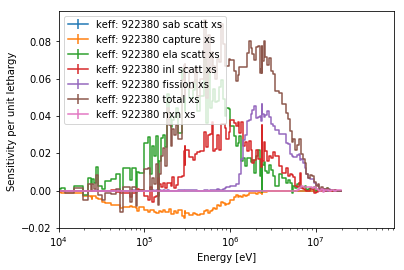

.. |reader| replace:: :py:class:`~serpentTools.parsers.sensitivity.SensitivityReader`

.. |sens| replace:: :py:attr:`~serpentTools.parsers.sensitivity.SensitivityReader.sensitivities`

.. |eneSens| replace::  :py:attr:`~serpentTools.parsers.sensitivity.SensitivityReader.energyIntegratedSens`

.. |plot| replace::  :py:meth:`~serpentTools.parsers.sensitivity.SensitivityReader.plot`

.. _ex-sensitivity:

Sensitivity Reader
==================

As of SERPENT 2.1.29, the ability to compute sensitivities using
Generalized Perturbation Theory [1]_. An overview of the functionality,
and how to enable these features is included on the `SERPENT wiki -
Sensitivity
Calculations <http://serpent.vtt.fi/mediawiki/index.php/Sensitivity_calculations>`__.
Sensitivity calculations produce ``_sens.m`` or ``_sensN.m`` files,
depending on the version of SERPENT, and contain a collection of arrays
and indexes, denoting the sensitivity of a quantity to perturbations in
isotopic parameters, such as cross sections or fission spectrum. These
perturbations can be applied to specific materials and/or isotopes.

The |reader| is capable of reading this file and storing
all the arrays and perturbation parameters contained therein. A basic
plot method is also contained on the reader.

.. code:: 
    
    >>> from matplotlib import pyplot
    >>> import serpentTools

.. note::

   The preferred way to read your own output files is with the
   :func:`~serpentTools.parsers.read` function. The
   :func:`~serpentTools.data.readDataFile` function is used here
   to make it easier to reproduce the examples

.. code:: 
    
    >>> sens = serpentTools.readDataFile('flattop_sens.m')

The arrays that are stored in |sens| and |eneSens| 
are stored under converted names. The original
names from SERPENT are of the form ``ADJ_PERT_KEFF_SENS`` or
``ADJ_PERT_KEFF_SENS_E_INT``, respectively. Since this reader stores the
resulting arrays in unique locations, the names are converted to a
succinct form. The two arrays listed above would be stored both as
``keff`` in |sens| and |eneSens|. All names
are converted to ``mixedCaseNames`` to fit the style of the project.

These arrays are quite large, so only their shapes will be shown in this
notebook.

.. code:: 
    
    >>> print(sens.sensitivities.keys(), sens.energyIntegratedSens.keys())

.. parsed-literal::
 

    dict_keys(['keff']) dict_keys(['keff'])

.. code:: 
    
    >>> print(sens.sensitivities['keff'].shape)

.. parsed-literal::
 

    (1, 2, 7, 175, 2)

.. code:: 
    
    >>> print(sens.energyIntegratedSens['keff'].shape)

.. parsed-literal::

    (1, 2, 7, 2)

The energy grid structure and lethargy widths are stored on the reader, as 
:py:attr:`~serpentTools.parsers.sensitivity.SensitivityReader.energies` and 
:py:attr:`~serpentTools.parsers.sensitivity.SensitivityReader.lethargyWidths`.

.. code:: 
    
    >>> print(sens.energies.shape)

.. parsed-literal::

    (176,)

.. code:: 
    
    >>> print(sens.energies[:10])

.. parsed-literal::

    [1.00001e-11 1.00001e-07 4.13994e-07 5.31579e-07 6.82560e-07 8.76425e-07
    1.12300e-06 1.44000e-06 1.85539e-06 2.38237e-06]

.. code:: 
    
    >>> print(sens.lethargyWidths.shape)

.. parsed-literal::

    (175,)

.. code:: 
    
    >>> print(sens.lethargyWidths[:10])

.. parsed-literal::

    [9.21034  1.42067  0.25     0.249999 0.250001 0.247908 0.248639 0.253452
    0.250001 0.249999]

Ordered dictionaries 
:py:attr:`~serpentTools.parsers.sensitivity.SensitivityReader.materials`,
:py:attr:`~serpentTools.parsers.sensitivity.SensitivityReader.zais`, and
:py:attr:`~serpentTools.parsers.sensitivity.SensitivityReader.perts`
contain keys of the names of their respective data, and the corresponding index,
``iSENS_ZAI_zzaaai``, in the sensitivity arrays. These arrays are
zero-indexed, so the first item will have an index of zero. The data
stored in the |sens| and |eneSens|
dictionaries has the exact same structure as if the arrays were loaded
into ``MATLAB``/``Octave``, but with zero-indexing.

.. code:: 
    
    >>> print(sens.materials)

.. parsed-literal::

    OrderedDict([('total', 0)])

.. code:: 
    
    >>> print(sens.zais)

.. parsed-literal::

    OrderedDict([('total', 0), (922380, 1)])

.. code:: 
    
    >>> print(sens.perts)

.. parsed-literal::

    OrderedDict([('total xs', 0), ('ela scatt xs', 1), ('sab scatt xs', 2), ('inl
    scatt xs', 3), ('capture xs', 4), ('fission xs', 5), ('nxn xs', 6)])

Plotting
--------

The |reader| has a |plot| method for visualizing the
sensitivities.

.. note::

    Without additional arguments, other than the name of the array,
    the |plot| method will plot **all** permutations of materials, isotopes,
    and isotope perturbations present. This can lead to a very busy plot and
    legend, so it is recommended that additional arguments are passed.

.. code:: 

    >>> sens.plot('keff');

.. image:: Sensitivity_files/Sensitivity_20_0.png

The following arguments can be used to filter the data present:

+------------+-----------------------------+
| key        | Action                      |
+============+=============================+
| ``'zai'``  | Isotopes(s) of interest     |
+------------+-----------------------------+
| ``'pert'`` | Perturbation(s) of interest |
+------------+-----------------------------+
| ``'mat'``  | Material(s) of interest     |
+------------+-----------------------------+

The ``sigma`` argument can be used to adjust the confidence interval
applied to the plot. The ``labelFmt`` argument can be used to modify the
label used for each plot. The following replacements will be made: 

1.  ``{r}`` - name of the response being plotted 
1. ``{m}`` - name of the material 
1. ``{z}`` - isotope zai 
1. ``{p}`` - specific perturbation

.. code:: 

    >>> ax = sens.plot('keff', 922380, mat='total', sigma=0,
    ...                labelFmt="{r}: {z} {p}")
    >>> ax.set_xlim(1E4);  # set the lower limit to be closer to what we care about

The argument ``normalize`` is used to turn on/off normalization per unit
lethargy, while ``legend`` can be used to turn off the legend, or set
the legend outside the plot.

.. code:: 

    >>> ax = sens.plot('keff', 922380, mat='total', sigma=0,
    ...                labelFmt="{r}: {z} {p}", legend='right')
    >>> ax.set_xlim(1E4);  # set the lower limit to be closer to what we care about

.. code:: 

    >>> sens.plot('keff', zai='total', pert=['total xs', 'fission xs'], labelFmt="{z} -  {p}", 
    ...           legend='above', ncol=2, normalize=False)
    >>> pyplot.xlim(1E4, 1E8);

Conclusion
----------

The |reader| can quickly read sensitivity files, and stores
all data present in the file. A versatile |plot| method can be used to
quickly visualize sensitivities.

References
----------

.. [1] Aufiero, M. et al. “A collision history-based approach to
       sensitivity/perturbation calculations in the continuous energy Monte
       Carlo code SERPENT”, Ann. Nucl. Energy, 152 (2015) 245-258.
