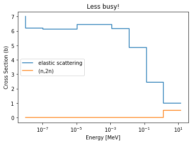
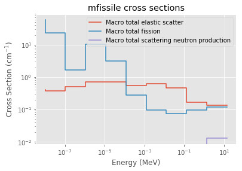

.. |xsections| replace:: :attr:`~serpentTools.XSPlotReader.xsections`
.. |xsdata| replace:: :class:`~serpentTools.objects.xsdata.XSData`

.. _ex-xsplot:

.. note::

    Data files, like the one used in this example, are not included with the
    python distribution. They can be downloaded from the GitHub repository,
    and accessed after setting the ``SERPENT_TOOLS_DATA`` environment
    variable

.. code::

    >>> import os
    >>> xfile = os.path.join(
    ...     os.environ["SERPENT_TOOLS_DATA"],
    ...     "plut_xs0.m")

Cross Section Reader/Plotter
============================

Basic Operation
---------------

Firstly, to get started plotting some cross sections from Serpent, you
generate a ``yourInputFileName_xs.m`` file using `set
xsplot <http://serpent.vtt.fi/mediawiki/index.php/Input_syntax_manual#set_xsplot>`__
as documented on the Serpent wiki. ``serpentTools`` can then read the
output, figuring out its file type automatically as with other readers.
Let’s plot some data used in the ``serpentTools`` regression suite.

.. code:: 
    
    >>> import serpentTools
    >>> xsreader = serpentTools.read(xfile)

This file contains some cross sections from a Serpent case containing a
chunk of plutonium metal reflected by beryllium. Let’s see what cross
sections are available from the file:

.. code::

    >>> xsreader.xsections.keys()
    dict_keys(['i4009_03c', 'i7014_03c', 'i8016_03c', 'i94239_03c', 'mbe',
    'mfissile'])

Notice that the important part of the reader is the |xsections|
attribute, which contains a dictionary of named |xsdata| objects. Entries
starting with “i” are isotopes, while “m” preceded names are materials.
Notably, materials not appearing in the neutronics calculation, e.g.,
external tanks in Serpent continuous reprocessing calculations, are not
printed in the ``yourInputFileName_xs.m`` file.

Plotting the entries is very easy, check this out:

.. code::

    >>> xsreader.xsections['i4009_03c'].plot(legend='right');

.. image:: images/XSPlot_files/XSPlot_8_0.png

This is nice to have an automatically generated legend, but gets
somewhat busy quickly. So, it’s easy to check which MT numbers are
available, and plot only a few:

.. code::

    >>> xsreader.xsections['i4009_03c'].showMT()
    MT numbers available for i4009_03c:
    -----------------------------------
    1     Total
    101   Sum of absorption
    2     elastic scattering
    102   (n,gamma)
    107   (n,alpha)
    16    (n,2n)
    105   (n,t)
    103   (n,p)
    104   (n,d)
    >>> xsreader.xsections['i4009_03c'].plot(mts=[2, 16], title='Less busy!');

Of course, the same process can be applied to materials, but Serpent has
some special unique negative MT numbers. The code will give you their
meaning without requiring your reference back to the wiki.

.. code::

    >>> xsreader.xsections['mfissile'].showMT()
    MT numbers available for mfissile:
    ----------------------------------
    -1   Macro total
    -3   Macro total elastic scatter
    -2   Macro total capture
    -6   Macro total fission
    -7   Macro total fission neutron production
    -16  Macro total scattering neutron production

    >>> xsreader.xsections['mfissile'].plot(mts=[-3, -6, -16], loglog=True)

Lastly, there are two ways to directly access data from Serpent’s xsplot
output. Firstly, if you’d like to see the data as-stored, just check the
attribute called “data” belonging to the |xsdata| object. Its columns
correspond to MT reactions, ordered in the same way as 
:meth:`~serpentTools.objects.XSData.showMT` presents.
The rows correspond to values at the energies in metadata[‘egrid’].

The other method regards presenting tabular data in a visually appealing
way. It uses pandas though, so make sure you have that installed to
obtain pretty tables.

.. code::

    >>> xsreader.xsections['mfissile'].xsdata
    array([[7.84253e+01, 4.04950e-01, 1.96698e+01, 5.83505e+01, 1.67674e+02,
            0.00000e+00],
           [3.61666e+01, 3.69643e-01, 1.20450e+01, 2.37520e+01, 6.80558e+01,
            0.00000e+00],
           [2.54417e+00, 5.06089e-01, 4.10559e-01, 1.62752e+00, 4.67294e+00,
            0.00000e+00],
           [1.30654e+01, 7.15384e-01, 2.01598e+00, 1.03340e+01, 2.95250e+01,
            0.00000e+00],
           [4.27811e+00, 7.21668e-01, 4.34122e-01, 3.12232e+00, 9.00007e+00,
            0.00000e+00],
           [8.22536e-01, 5.37059e-01, 3.51405e-03, 2.81963e-01, 8.14254e-01,
            0.00000e+00],
           [7.81066e-01, 6.23379e-01, 4.77288e-02, 9.38536e-02, 2.71066e-01,
            0.00000e+00],
           [5.83509e-01, 4.58020e-01, 1.08053e-02, 7.51650e-02, 2.17468e-01,
            0.00000e+00],
           [3.41750e-01, 1.63555e-01, 7.72110e-04, 9.51295e-02, 2.91685e-01,
            0.00000e+00],
           [2.93887e-01, 1.36424e-01, 1.13642e-04, 1.20609e-01, 5.96505e-01,
            1.28477e-02]])
    >>> xsreader.xsections['mfissile'].tabulate()

.. raw:: html

    

    
    <table border="1" class="dataframe">
      <thead>
        <tr style="text-align: right;">
          <th></th>
          <th>Energy (MeV)</th>
          <th>MT -1 cm$^{-1}$</th>
          <th>MT -3 cm$^{-1}$</th>
          <th>MT -2 cm$^{-1}$</th>
          <th>MT -6 cm$^{-1}$</th>
          <th>MT -7 cm$^{-1}$</th>
          <th>MT -16 cm$^{-1}$</th>
        </tr>
      </thead>
      <tbody>
        <tr>
          <th>0</th>
          <td>1.000000e-08</td>
          <td>78.425300</td>
          <td>0.404950</td>
          <td>19.669800</td>
          <td>58.350500</td>
          <td>167.674000</td>
          <td>0.000000</td>
        </tr>
        <tr>
          <th>1</th>
          <td>1.038910e-07</td>
          <td>36.166600</td>
          <td>0.369643</td>
          <td>12.045000</td>
          <td>23.752000</td>
          <td>68.055800</td>
          <td>0.000000</td>
        </tr>
        <tr>
          <th>2</th>
          <td>1.079340e-06</td>
          <td>2.544170</td>
          <td>0.506089</td>
          <td>0.410559</td>
          <td>1.627520</td>
          <td>4.672940</td>
          <td>0.000000</td>
        </tr>
        <tr>
          <th>3</th>
          <td>1.121350e-05</td>
          <td>13.065400</td>
          <td>0.715384</td>
          <td>2.015980</td>
          <td>10.334000</td>
          <td>29.525000</td>
          <td>0.000000</td>
        </tr>
        <tr>
          <th>4</th>
          <td>1.164980e-04</td>
          <td>4.278110</td>
          <td>0.721668</td>
          <td>0.434122</td>
          <td>3.122320</td>
          <td>9.000070</td>
          <td>0.000000</td>
        </tr>
        <tr>
          <th>5</th>
          <td>1.210320e-03</td>
          <td>0.822536</td>
          <td>0.537059</td>
          <td>0.003514</td>
          <td>0.281963</td>
          <td>0.814254</td>
          <td>0.000000</td>
        </tr>
        <tr>
          <th>6</th>
          <td>1.257420e-02</td>
          <td>0.781066</td>
          <td>0.623379</td>
          <td>0.047729</td>
          <td>0.093854</td>
          <td>0.271066</td>
          <td>0.000000</td>
        </tr>
        <tr>
          <th>7</th>
          <td>1.306350e-01</td>
          <td>0.583509</td>
          <td>0.458020</td>
          <td>0.010805</td>
          <td>0.075165</td>
          <td>0.217468</td>
          <td>0.000000</td>
        </tr>
        <tr>
          <th>8</th>
          <td>1.357190e+00</td>
          <td>0.341750</td>
          <td>0.163555</td>
          <td>0.000772</td>
          <td>0.095130</td>
          <td>0.291685</td>
          <td>0.000000</td>
        </tr>
        <tr>
          <th>9</th>
          <td>1.410000e+01</td>
          <td>0.293887</td>
          <td>0.136424</td>
          <td>0.000114</td>
          <td>0.120609</td>
          <td>0.596505</td>
          <td>0.012848</td>
        </tr>
      </tbody>
    </table>
    

Conclusions
-----------

``serpentTools`` can plot your Serpent XS data in a friendly way. We’re
always looking to improve the feel of the code though, so let us know if
there are changes you would like.

Keep in mind that setting an energy grid with closer to 10000 points
makes far prettier XS plots however. There were none in this example to
not clog up the repository.
