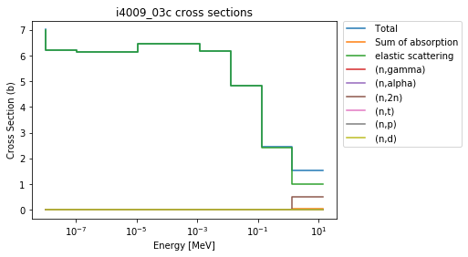
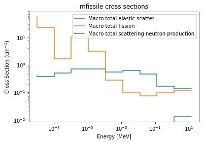

.. |xsections| replace:: :attr:`~serpentTools.XSPlotReader.xsections`
.. |xsdata| replace:: :class:`~serpentTools.objects.XSData`

.. _ex-xsplot:

Cross Section Reader/Plotter
============================

Basic Operation
---------------

Firstly, to get started plotting some cross sections from Serpent, you
generate a ``yourInputFileName_xs.m`` file using `set
xsplot <http://serpent.vtt.fi/mediawiki/index.php/Input_syntax_manual#set_xsplot>`__
as documented on the Serpent wiki. ``serpentTools`` can then read the
output, figuring out its file type automatically as with other readers.
Let’s plot some data used in the ``serpentTools`` regression suite.

.. note::

   The preferred way to read your own output files is with the
   |read-full| function. The |readData| function is used here
   to make it easier to reproduce the examples

.. code:: 
    
    >>> import serpentTools
    >>> xsreader = serpentTools.readDataFile('plut_xs0.m')

This file contains some cross sections from a Serpent case containing a
chunk of plutonium metal reflected by beryllium. Let’s see what cross
sections are available from the file:

.. code::

    >>> xsreader.xsections.keys()
    dict_keys(['i4009_03c', 'i7014_03c', 'i8016_03c', 'i94239_03c', 'mbe',
    'mfissile'])

Notice that the important part of the reader is the |xsections|
attribute, which contains a dictionary of named |xsdata| objects. Entries
starting with “i” are isotopes, while “m” preceded names are materials.
Notably, materials not appearing in the neutronics calculation, e.g.,
external tanks in Serpent continuous reprocessing calculations, are not
printed in the ``yourInputFileName_xs.m`` file.

These |xsdata| instances can be obtained by indexing into the |xsections|
dictionary or the reader

.. code::

    >>> xsreader.xsections["i4009_03c"] is xsreader["i4009_03c"]
    True

The final bit of useful information stored on the reader are the energy
groups and majorant cross sections. The energy groups are shared
across all |xsdata| objects stored on the reader

.. code::

    >>> xsreader.energies
    array([1.00000e-08, 1.03891e-07, 1.07934e-06, 1.12135e-05, 1.16498e-04,
           1.21032e-03, 1.25742e-02, 1.30635e-01, 1.35719e+00, 1.41000e+01])
    >>> xsreader.majorant
    array([78.4253  , 36.1666  ,  2.54417 , 13.0654  ,  4.27811 ,  0.822536,
           0.781066,  0.598564,  0.34175 ,  0.293887])

Data Access
-----------

Most of the useful information is stored on the |xsdata| instances.
These are primarily cross sections provided by Serpent and some
descriptive data. The ``MT`` and ``MTdescrip`` attributes describe the
ordering of the reactions and their descriptions

.. code::

    >>> o16 = xsreader["i8016_03c"]
    # Make a quick dictionary to show descriptions
    >>> dict(zip(o16.MT, o16.MTdescrip))
    {1: 'Total',
     101: 'Sum of absorption',
     2: 'elastic scattering',
     ...
     105: '(n,t)',
     23: '(n,n3alpha)',
     16: '(n,2n)'}

Cross section data are stored in the ``xsdata`` array, which has
shape ``(N_E, N_MT)``

.. code::

    >>> o16.xsdata.shape == (len(o16.energies), len(o16.MT))
    True

The data can be obtained in a few different ways. First, you can
index into the array directly

.. code::

    >>> o16.xsdata[:, 0]
    array([4.16597, 3.88237, 3.85502, 3.8523 , 3.8518 , 3.84938, 3.82434,
           3.58676, 3.19656, 1.593  ])

This does require you to know the position of your reaction. Alternatively,
you can index into the |xsdata| object using the reaction MT as a key

.. code::

    >>> o16[1]
    array([4.16597, 3.88237, 3.85502, 3.8523 , 3.8518 , 3.84938, 3.82434,
           3.58676, 3.19656, 1.593  ])

The ``tabulate`` method can be used to create a :class:`pandas.DataFrame``
for nice tabular representation.

.. code::

    >>> xsreader.xsections['mfissile'].tabulate()

.. raw:: html

    

    
    <table border="1" class="dataframe">
      <thead>
        <tr style="text-align: right;">
          <th></th>
          <th>Energy (MeV)</th>
          <th>MT -1 cm$^{-1}$</th>
          <th>MT -3 cm$^{-1}$</th>
          <th>MT -2 cm$^{-1}$</th>
          <th>MT -6 cm$^{-1}$</th>
          <th>MT -7 cm$^{-1}$</th>
          <th>MT -16 cm$^{-1}$</th>
        </tr>
      </thead>
      <tbody>
        <tr>
          <th>0</th>
          <td>1.000000e-08</td>
          <td>78.425300</td>
          <td>0.404950</td>
          <td>19.669800</td>
          <td>58.350500</td>
          <td>167.674000</td>
          <td>0.000000</td>
        </tr>
        <tr>
          <th>1</th>
          <td>1.038910e-07</td>
          <td>36.166600</td>
          <td>0.369643</td>
          <td>12.045000</td>
          <td>23.752000</td>
          <td>68.055800</td>
          <td>0.000000</td>
        </tr>
        <tr>
          <th>2</th>
          <td>1.079340e-06</td>
          <td>2.544170</td>
          <td>0.506089</td>
          <td>0.410559</td>
          <td>1.627520</td>
          <td>4.672940</td>
          <td>0.000000</td>
        </tr>
        <tr>
          <th>3</th>
          <td>1.121350e-05</td>
          <td>13.065400</td>
          <td>0.715384</td>
          <td>2.015980</td>
          <td>10.334000</td>
          <td>29.525000</td>
          <td>0.000000</td>
        </tr>
        <tr>
          <th>4</th>
          <td>1.164980e-04</td>
          <td>4.278110</td>
          <td>0.721668</td>
          <td>0.434122</td>
          <td>3.122320</td>
          <td>9.000070</td>
          <td>0.000000</td>
        </tr>
        <tr>
          <th>5</th>
          <td>1.210320e-03</td>
          <td>0.822536</td>
          <td>0.537059</td>
          <td>0.003514</td>
          <td>0.281963</td>
          <td>0.814254</td>
          <td>0.000000</td>
        </tr>
        <tr>
          <th>6</th>
          <td>1.257420e-02</td>
          <td>0.781066</td>
          <td>0.623379</td>
          <td>0.047729</td>
          <td>0.093854</td>
          <td>0.271066</td>
          <td>0.000000</td>
        </tr>
        <tr>
          <th>7</th>
          <td>1.306350e-01</td>
          <td>0.583509</td>
          <td>0.458020</td>
          <td>0.010805</td>
          <td>0.075165</td>
          <td>0.217468</td>
          <td>0.000000</td>
        </tr>
        <tr>
          <th>8</th>
          <td>1.357190e+00</td>
          <td>0.341750</td>
          <td>0.163555</td>
          <td>0.000772</td>
          <td>0.095130</td>
          <td>0.291685</td>
          <td>0.000000</td>
        </tr>
        <tr>
          <th>9</th>
          <td>1.410000e+01</td>
          <td>0.293887</td>
          <td>0.136424</td>
          <td>0.000114</td>
          <td>0.120609</td>
          <td>0.596505</td>
          <td>0.012848</td>
        </tr>
      </tbody>
    </table>
    

Lastly, the descriptions for each reaction can be found in ``MTdescrip`` or
using ``describe``

.. code::

    >>> o16.MTdescrip[0]
    'Total'
    >>> o16.describe(1)
    'Total'

Plotting
--------

Plotting reactions is provided through the
:meth:`~serpentTools.objects.XSData.plot` method. With no MTs provided,
all reactions are plotted and labeled

.. code::

    >>> be9 = xsreader['i4009_03c']
    >>> be9.plot(legend='right');

This is nice to have an automatically generated legend, but gets
somewhat busy quickly. So, it’s easy to check which MT numbers are
available, and plot only a few:

.. code::

    >>> be9.showMT()
    MT numbers available for i4009_03c:
    -----------------------------------
    1     Total
    101   Sum of absorption
    2     elastic scattering
    102   (n,gamma)
    107   (n,alpha)
    16    (n,2n)
    105   (n,t)
    103   (n,p)
    104   (n,d)
    >>> be9.plot(mts=[2, 16], title='Less busy!');

Of course, the same process can be applied to materials, but Serpent has
some special unique negative MT numbers. The code will give you their
meaning without requiring your reference back to the wiki.

.. code::

    >>> xsreader['mfissile'].showMT()
    MT numbers available for mfissile:
    ----------------------------------
    -1   Macro total
    -3   Macro total elastic scatter
    -2   Macro total capture
    -6   Macro total fission
    -7   Macro total fission neutron production
    -16  Macro total scattering neutron production

    >>> xsreader['mfissile'].plot(mts=[-3, -6, -16], loglog=True)

Labels can be configured through the ``labels`` argument

.. code::

    >>> xsreader['mfissile'].plot(
    ...     mts=[-3, -6], loglog=True,
    ...     labels=["Total elastic scatter", "Total fission"])

Conclusions
-----------

``serpentTools`` can plot your Serpent XS data in a friendly way. We’re
always looking to improve the feel of the code though, so let us know if
there are changes you would like.

Keep in mind that setting an energy grid with closer to 10000 points
makes far prettier XS plots however. There were none in this example to
not clog up the repository.
