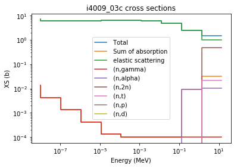
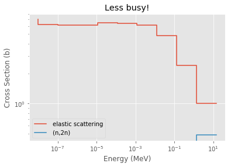
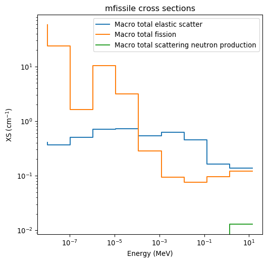

Copyright (c) 2017-2018 Andrew Johnson, Dan Kotlyar, Stefano Terlizzi,
Gavin Ridley, GTRC

THE SOFTWARE IS PROVIDED “AS IS”, WITHOUT WARRANTY OF ANY KIND, EXPRESS
OR IMPLIED, INCLUDING BUT NOT LIMITED TO THE WARRANTIES OF
MERCHANTABILITY, FITNESS FOR A PARTICULAR PURPOSE AND NONINFRINGEMENT.
IN NO EVENT SHALL THE AUTHORS OR COPYRIGHT HOLDERS BE LIABLE FOR ANY
CLAIM, DAMAGES OR OTHER LIABILITY, WHETHER IN AN ACTION OF CONTRACT,
TORT OR OTHERWISE, ARISING FROM, OUT OF OR IN CONNECTION WITH THE
SOFTWARE OR THE USE OR OTHER DEALINGS IN THE SOFTWARE.

Cross Section Reader/Plotter
============================

Basic Operation
---------------

Firstly, to get started plotting some cross sections from Serpent, you
generate a yourInputFileName_xs.m file using `set
xsplot <http://serpent.vtt.fi/mediawiki/index.php/Input_syntax_manual#set_xsplot>`__
as documented on the Serpent wiki. ``serpentTools`` can then read the
output, figuring out its filetype automatically as with other readers.
Let’s plot some data used in the ``serpentTools`` regression suite.

.. code:: ipython3

    import os
    import serpentTools
    import matplotlib.pyplot as plt
    %matplotlib inline
    
    xsreader = serpentTools.read('../serpentTools/tests/plut_xs0.m')

.. parsed-literal::

    INFO    : serpentTools: Inferred reader for ../serpentTools/tests/plut_xs0.m: XSPlotReader
    WARNING : serpentTools: Could not obtain settings for the following reader names: xsplot
    INFO    : serpentTools: Preparing to read ../serpentTools/tests/plut_xs0.m
    INFO    : serpentTools: Done reading xsplot file

This file contains some cross sections from a Serpent case containing a
chunk of plutonium metal reflected by beryllium. Let’s see what cross
sections are available from the file:

.. code:: ipython3

    xsreader.xsections.keys()

.. parsed-literal::

    dict_keys(['i4009_03c', 'i7014_03c', 'i8016_03c', 'i94239_03c', 'mbe', 'mfissile'])

Notice that the important part of the reader is the ``xsections``
attribute, which contains a dictionary of named XSData objects. Entries
starting with “i” are isotopes, while “m” preceded names are materials.
Notably, materials not appearing in the neutronics calculation, e.g.,
external tanks in Serpent continuous reprocessing calculations, are not
printed in the yourInputFileName_xs.m file.

Plotting the entries is very easy, check this out:

.. code:: ipython3

    fig = xsreader.xsections['i4009_03c'].plot('all')

This is nice to have an automatically generated legend, but gets
somewhat busy quickly. So, it’s easy to check which MT numbers are
available, and plot only a few:

.. code:: ipython3

    xsreader.xsections['i4009_03c'].showMT()

.. parsed-literal::

    MT numbers available for i4009_03c:
    -----------------------------------
    1     Total
    101   Sum of absorption
    2     elastic scattering
    102   (n,gamma)
    107   (n,alpha)
    16    (n,2n)
    105   (n,t)
    103   (n,p)
    104   (n,d)

.. code:: ipython3

    fig2 = xsreader.xsections['i4009_03c'].plot([2, 16])

Of course, the same process can be applied to materials, but Serpent has
some special unique negative MT numbers. The code will give you their
meaning without requiring your reference back to the wiki.

.. code:: ipython3

    xsreader.xsections['mfissile'].showMT()

.. parsed-literal::

    MT numbers available for mfissile:
    ----------------------------------
    -1   Macro total
    -3   Macro total elastic scatter
    -2   Macro total capture
    -6   Macro total fission
    -7   Macro total fission neutron production
    -16  Macro total scattering neutron production

Note that any extra arguments passed to the plot method get passed on to
matplotlib’s plotting, and not figure instantiations. So, if you want to
change figure options, this goes in its own dictionary:

.. code:: ipython3

    lastfig = xsreader.xsections['mfissile'].plot([-3, -6, -16], 'g', figargs={'dpi':96, 'figsize':(6,6)})

Conclusions
-----------

``serpentTools`` can plot your Serpent XS data in a friendly way. We’re
always looking to improve the feel of the code though, so let us know if
there are changes you would like.

Keep in mind that setting an energy grid with closer to 10000 points
makes far prettier XS plots however. There were none in this example to
not clog up the repository.
